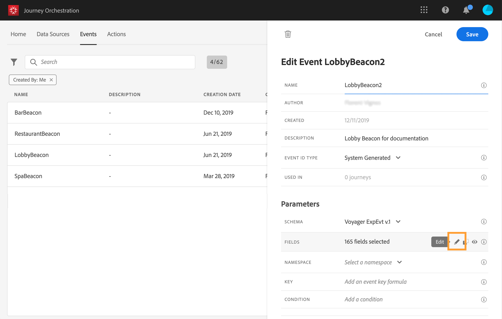
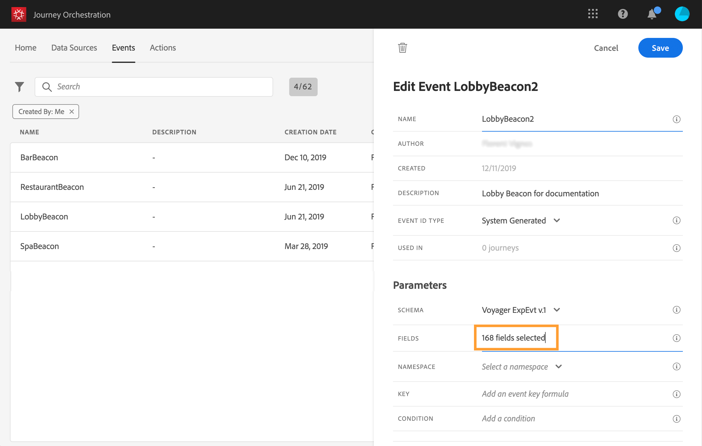

# 定義裝載欄位 {#concept_yrw_3qt_52b}

有效負載定義可讓您選擇系統預期從歷程中的事件接收的資訊，以及識別與事件相關聯之人員的金鑰。 裝載以Experience CloudXDM欄位定義為基礎。 如需XDM的詳細資訊，請參閱[此頁面](https://experienceleague.adobe.com/docs/experience-platform/xdm/home.html?lang=zh-Hant)。

1. 從清單中選取XDM架構，然後按一下&#x200B;**[!UICONTROL Payload]**&#x200B;欄位或&#x200B;**[!UICONTROL Edit]**&#x200B;圖示。

   

   架構中定義的所有欄位都會顯示。 欄位清單因結構而異。 您可以搜尋特定欄位，或使用篩選器來顯示所有節點和欄位，或僅顯示選取的欄位。 根據架構定義，某些欄位可能是必填欄位，且已預先選取。 您無法取消選取它們。 依預設，會選取所有必填欄位，讓Journey Orchestration正確接收事件。

   >[!NOTE]
   >
   >請務必將「協調」mixin新增至XDM結構。 這將確保您的架構包含使用[!DNL Journey Orchestration]所需的所有資訊。

   

1. 選取您要從事件接收的欄位。 這些是業務使用者在歷程中將利用的欄位。 它們還必須包含用於識別與事件相關聯的人員的金鑰（請參閱[此頁面](../event/defining-the-event-key.md)）。

   

   >[!NOTE]
   >
   >對於系統產生的事件，**[!UICONTROL eventID]**&#x200B;欄位會自動新增至選取的欄位清單中，以便[!DNL Journey Orchestration]可識別事件。 推送事件的系統不應產生ID，而應使用有效負載預覽中可用的ID。 請參閱[此頁面](../event/previewing-the-payload.md)。

1. 選擇完所需欄位後，按一下&#x200B;**[!UICONTROL Save]**&#x200B;或按&#x200B;**[!UICONTROL Enter]**&#x200B;鍵。

   

   選定欄位的數量顯示在&#x200B;**[!UICONTROL Payload]**&#x200B;欄位中。

   
