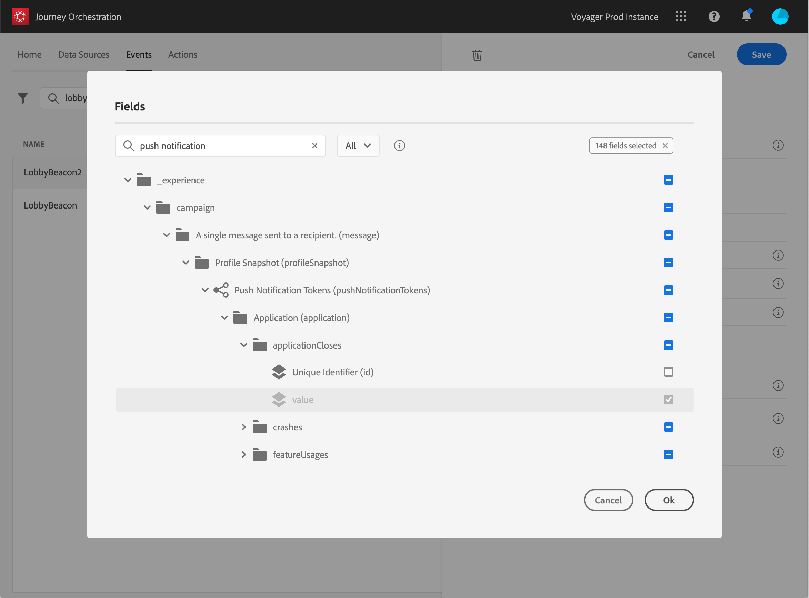

# 定義裝載欄位 {#concept_yrw_3qt_52b}

有效負載定義可讓您選擇系統預期從歷程中的事件接收的資訊，以及識別與事件相關聯的人員的金鑰。 裝載基於Experience CloudXDM欄位定義。 有關XDM的詳細資訊，請參閱[本頁](https://docs.adobe.com/content/help/zh-Hant/experience-platform/xdm/home.html)。

1. 從清單中選擇XDM方案，然後按一下&#x200B;**[!UICONTROL Payload]**&#x200B;欄位或&#x200B;**[!UICONTROL Edit]**&#x200B;表徵圖。

   

   將顯示架構中定義的所有欄位。 欄位清單會依不同的架構而有所不同。 您可以搜尋特定欄位，或使用篩選器來顯示所有節點和欄位，或僅顯示選取的欄位。 根據架構定義，某些欄位可能是必填和預選的。 您無法取消選取它們。 預設情況下，系統會選擇事件必須由Journey Orchestration正確接收的所有欄位。

   >[!NOTE]
   >
   >請確定您已將「協調」混合加入XDM架構。 這將確保您的架構包含所有使用[!DNL Journey Orchestration]所需的資訊。

   

1. 選擇您希望從事件接收的欄位。 這些是商業使用者在歷程中將運用的欄位。 它們還必須包含用於識別與事件相關聯的人員的密鑰（請參閱[本頁](../event/defining-the-event-key.md)）。

   

   >[!NOTE]
   >
   >對於系統生成的事件，**[!UICONTROL eventID]**&#x200B;欄位會自動添加到選定欄位的清單中，以便[!DNL Journey Orchestration]能夠識別事件。 推送事件的系統不應產生ID，而應使用裝載預覽中可用的ID。 請參閱[本頁](../event/previewing-the-payload.md)。

1. 選擇完所需欄位後，按一下&#x200B;**[!UICONTROL Save]**&#x200B;或按&#x200B;**[!UICONTROL Enter]**。

   

   選擇的欄位數顯示在&#x200B;**[!UICONTROL Payload]**&#x200B;欄位中。

   
