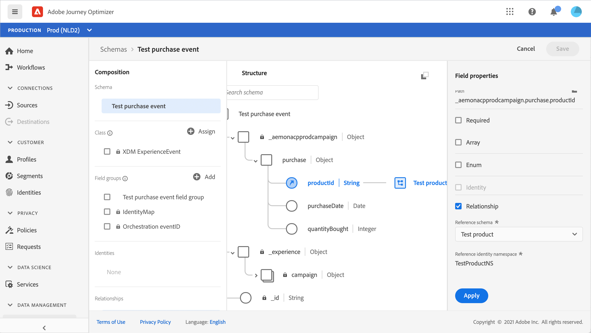

# 關於ExperienceEvent結構 [!DNL Journey Orchestration] 事件

[!DNL Journey Orchestration] 事件是透過串流獲取傳送至Adobe Experience Platform的XDM體驗事件。

因此，設定事件的重要先決條件 [!DNL Journey Orchestration] 您應熟悉Adobe Experience Platform的體驗資料模型（或XDM），以及如何組成XDM體驗事件結構，以及如何將XDM格式化資料串流至Adobe Experience Platform。

## 的結構需求 [!DNL Journey Orchestration] 事件

設定 [!DNL Journey Orchestration] 是為了確保您已定義XDM結構來代表事件，並建立資料集來記錄Adobe Experience Platform上的事件例項。 雖然不一定需要為事件建立資料集，但將事件傳送至特定資料集可讓您維護使用者的事件歷史記錄，以供日後參考和分析，因此這始終是個好主意。 如果您尚未擁有適合事件的結構和資料集，可在Adobe Experience Platform網頁介面中完成這兩項工作。

將用於的任何XDM結構 [!DNL Journey Orchestration] 事件應符合下列要求：

* 結構必須為XDM ExperienceEvent類別。

   

* 對於系統產生的事件，結構必須包含Orchestration eventID mixin。 [!DNL Journey Orchestration] 使用此欄位來識別歷程中使用的事件。

   

* 宣告身分欄位，以識別事件的主題。 如果未指定身份，則可以使用身份映射。 不建議採用此做法。

   

* 如果您希望此資料在稍後的歷程中可供查閱，請為設定檔標籤結構和資料集。

   

   

* 歡迎加入資料欄位，以擷取您要與事件一併包含的任何其他內容資料，例如使用者、產生事件的裝置、位置，或與事件相關的任何其他有意義的情況等資訊。

   

   

## 利用結構描述關係{#leverage_schema_relationships}

Adobe Experience Platform可讓您定義結構間的關係，以使用一個資料集做為另一個資料集的查閱表格。

假設您的品牌資料模型具有擷取購買的結構描述。 您也有產品目錄的結構。 您可以在購買結構中擷取產品ID，並使用關係從產品目錄中尋找更完整的產品詳細資訊。 這可讓您為購買筆記型電腦的所有客戶建立區段，例如，不需要明確列出所有筆記型電腦ID，或擷取交易系統中的每個單一產品詳細資訊。

若要定義關係，您必須在來源架構中有一個專用欄位，在此例中是購買架構中的產品ID欄位。 此欄位需要參考目標結構中的產品ID欄位。 必須為配置檔案啟用源表和目標表，並且目標架構必須將該公共欄位定義為其主標識。

以下為以定義為主要身分的產品ID為設定檔啟用的產品目錄結構。

以下是產品ID欄位上定義之關係的購買結構。

>[!NOTE]
>
>深入了解 [Experience Platform檔案](https://experienceleague.adobe.com/docs/platform-learn/tutorials/schemas/configure-relationships-between-schemas.html?lang=en).

然後，在Journey Orchestration中，您可以利用連結表格中的所有欄位：

* 設定單一事件時， [了解詳情](../event/experience-event-schema.md#unitary_event_configuration)
* 在歷程中使用條件時， [了解詳情](../event/experience-event-schema.md#journey_conditions_using_event_context)
* 在自訂動作個人化中， [了解詳情](../event/experience-event-schema.md#custom_action_personalization_with_journey_event_context)

### 單一事件配置{#unitary_event_configuration}

連結的結構欄位在統一事件配置中可用：

* 瀏覽事件設定畫面中的事件結構欄位時。
* 定義系統產生事件的條件時。

連結的欄位不可用：

* 在事件鍵公式中
* 事件id條件中（規則型事件）

若要了解如何設定統一事件，請參閱 [頁面](../event/about-creating.md).

### 使用事件內容的歷程條件{#journey_conditions_using_event_context}

您可以使用連結至歷程中使用之事件的查閱表格資料來建立條件（運算式編輯器）。

在歷程中新增條件、編輯運算式，並在運算式編輯器中展開事件節點。

若要了解如何定義歷程條件，請參閱 [頁面](../building-journeys/condition-activity.md).

### 使用歷程事件內容進行動作個人化{#custom_action_personalization_with_journey_event_context}

設定歷程動作活動的動作參數時，可使用連結的欄位。

若要了解如何使用自訂動作，請參閱 [頁面](../building-journeys/using-custom-actions.md).

