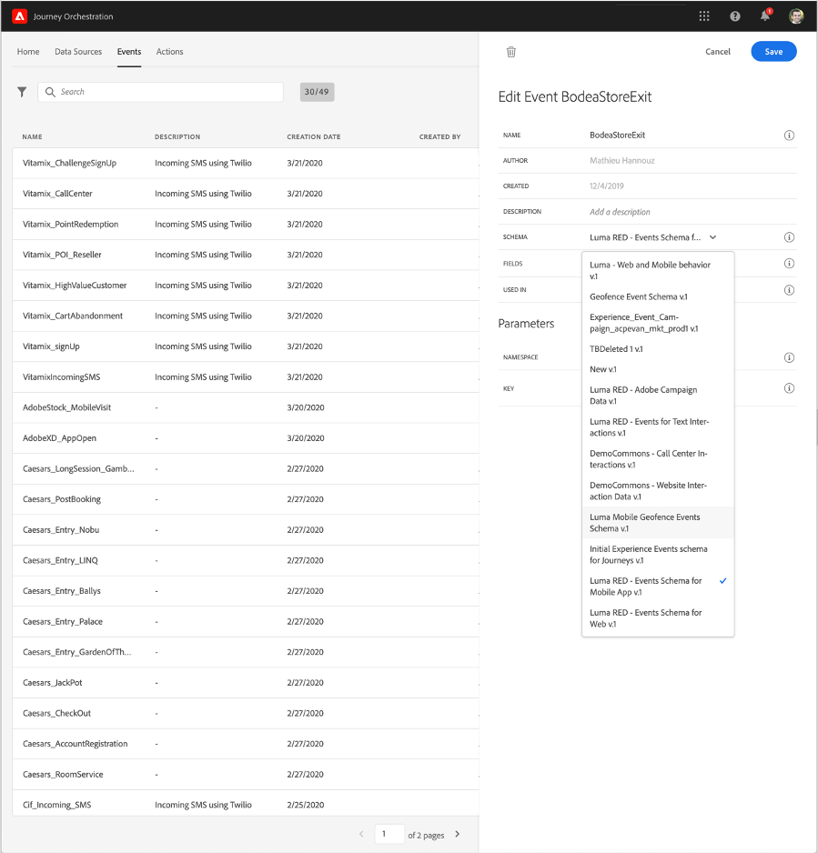

# 關於事件的ExperienceEvent結 [!DNL Journey Orchestration] 構

[!DNL Journey Orchestration] 事件是透過串流擷取傳送至Adobe Experience Platform的XDM Experience Events。

因此，設定事件的重要先決條件是您熟悉 [!DNL Journey Orchestration] Adobe Experience Platform的「體驗資料模型」（或XDM），以及如何組成XDM體驗事件結構，以及如何將XDM格式的資料串流至Adobe Experience Platform。

## 事件的架構需 [!DNL Journey Orchestration] 求

設定事件的第一步是確 [!DNL Journey Orchestration] 保您已定義XDM架構來代表事件，並建立資料集來記錄Adobe Experience Platform上的事件例項。 您並不需要為事件建立資料集，但是將事件傳送至特定資料集可讓您維護使用者的事件歷史記錄，以供日後參考和分析，因此這永遠是個好主意。 如果您尚未擁有適合事件的架構和資料集，這兩項工作都可在Adobe Experience Platform網頁介面中完成。

將用於事件的任何XDM [!DNL Journey Orchestration] 架構都應滿足以下要求：

* 架構必須是XDM ExperienceEvent類別。

   

* 對於系統產生的事件，架構必須包含Orchestration eventID mixin。 [!DNL Journey Orchestration] 使用此欄位來識別歷程中使用的事件。

   

* 宣告識別欄位以識別事件的主體。 如果未指定任何身分，則可使用身份映射。 不建議使用。

   

* 如果您希望此資料在稍後的歷程中可供查閱，請標籤描述檔和資料集。

   

   

* 您可自由地加入資料欄位，以擷取您想要與事件一起包含的任何其他上下文資料，例如有關使用者、事件產生裝置、位置或與事件相關的任何其他有意義情況的資訊。

   

   