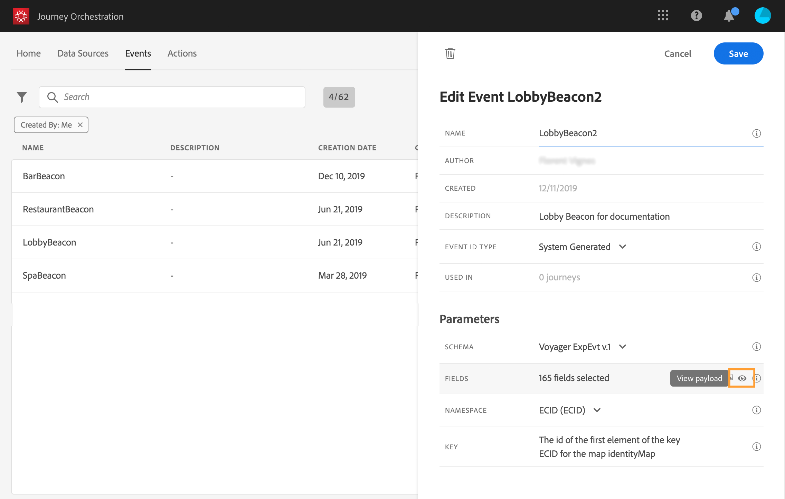

# 預覽裝載 {#concept_jgf_4yk_4fb}

裝載預覽可讓您驗證裝載定義。

>[!NOTE]
>
>當您建立事件時，在檢視裝載預覽之前，請先儲存事件並重新開啟它。 需要此步驟，才能在裝載中產生事件ID。

1. 按一下 **[!UICONTROL View Payload]** 圖示，預覽系統預期的裝載。

   

   您可以注意到選取的欄位會顯示。

   

1. 勾選預覽以驗證裝載定義。

1. 然後，您可以將裝載預覽共用給負責事件傳送的人員。 此裝載可協助他設計推送至之事件的設定 [!DNL Journey Orchestration]。 請參閱[本頁](../event/additional-steps-to-send-events-to-journey-orchestration.md)。
