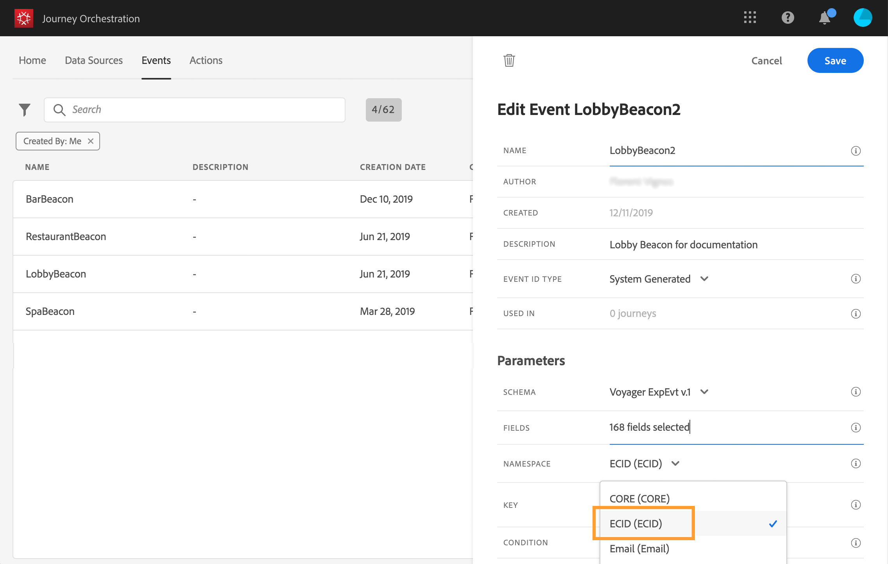

# 選取命名空間 {#concept_ckb_3qt_52b}

命名空間可讓您定義用來識別與事件關聯之人員的索引鍵類型。 其配置是可選的。 如果您想在歷程中擷取來自即時客戶個人檔案的其 [他資訊，則此為必要項](https://docs.adobe.com/content/help/zh-Hant/experience-platform/profile/home.html)。 如果您僅使用來自第三方系統的資料透過自訂資料來源，則不需要命名空間定義。

您可以使用其中一個預先定義的名稱空間，或使用Identity Namespace服務建立新的名稱空間。 Refer to this [page](https://docs.adobe.com/content/help/zh-Hant/experience-platform/identity/home.html).

如果選擇具有主標識的方案，則預 **[!UICONTROL Key]** 填充 **[!UICONTROL Namespace]** 和欄位。 如果未定義任何識別，我們會選 _擇identityMap > id_ (id)作為主要金鑰。 然後，您必須選取命名空間，然後使用identityMap > id預先填入 **[!UICONTROL Namespace]** 索引 _鍵（在欄位下）_。

選擇欄位時，標籤主標識欄位。

從下拉式清單中選取命名空間。

每個歷程僅允許一個命名空間。 如果您在同一歷程中使用數個事件，它們需要使用相同的命名空間。 請參閱。
