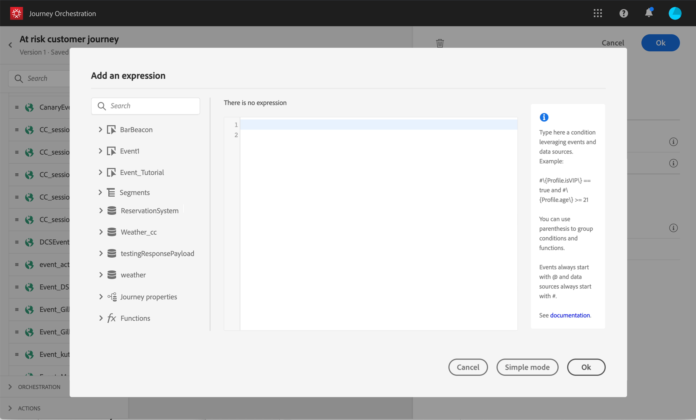
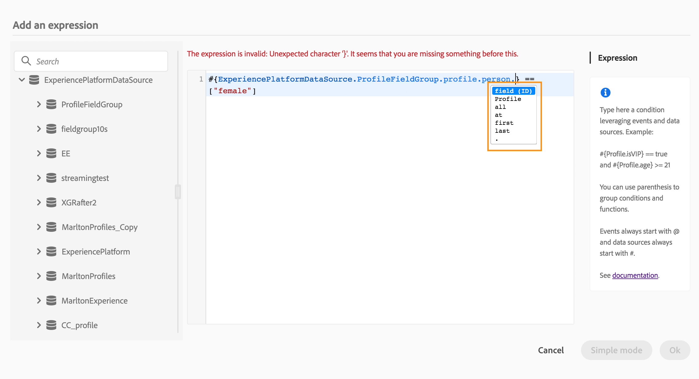
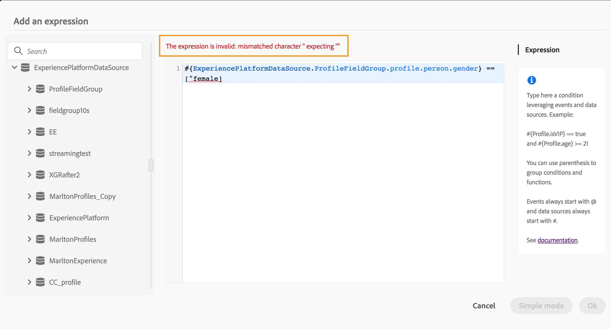

# 關於進階運算式編輯器 {#concept_uyj_trt_52b}

使用進階運算式編輯器在介面的不同畫面中建置進階運算式。例如，您可以在設定和使用歷程以及定義資料來源條件時，建立運算式。
此外，您每次必須定義需要特定資料處理的動作參數時，都可以使用它。您可以善用來自事件的資料或是從資料來源擷取的其他資訊。在歷程中，顯示的事件欄位清單會與情境相關，而且會根據歷程中新增的事件而有所不同。

進階運算式編輯器提供一組內建函式和運算子，讓您得以控制值並定義特別符合您需求的運算式。進階運算式編輯器也可讓您定義外部資料來源參數的值、控制對應欄位和集合，例如體驗事件。

_進階運算式編輯器介面_

進階運算式編輯器可用於：

* 建立[資料來源](../building-journeys/condition-activity.md#about_condition)及事件資訊的進階條件
* 定義自訂[等待活動](../building-journeys/wait-activity.md#custom)
* 定義動作參數對應

如有可能，您可以使用 **[!UICONTROL Advanced mode]** / **[!UICONTROL Simple mode]** 按鈕，在兩個模式之間進行切換。[此處](../building-journeys/condition-activity.md#about_condition)會說明簡單模式。

>[!NOTE]
>
>可在簡單或進階運算式編輯器中定義條件。它們一律會傳回布林值類型。
>
>藉由選取欄位或透過進階運算式編輯器，以定義動作參數。他們會根據其運算式傳回特定資料類型。

## 存取進階運算式編輯器 {#section_fdz_4nj_cjb}

您可以透過不同方式存取進階運算式編輯器：

* 建立資料來源條件時，可按一下 **[!UICONTROL Advanced mode]** 以存取進階編輯器。

  

* 建立自訂計時器時，會直接顯示進階編輯器。
* 對應動作參數時，按一下 **[!UICONTROL Advanced mode]**。

## 探索介面{#section_otq_tnj_cjb}

此畫面可讓您手動編寫運算式。

在畫面左側，會顯示可用的欄位和函式：

* **[!UICONTROL Events]**：從入站事件接收的其中一個欄位。顯示的事件欄位清單會與情境相關，而且會根據歷程中新增的事件而有所不同。 [閱讀全文](../event/about-events.md)
* **[!UICONTROL Segments]**：如果您已卸除&#x200B;**[!UICONTROL Segment qualification]**&#x200B;事件，請選擇要在運算式中使用的區段。 [閱讀全文](../segment/using-a-segment.md)
* **[!UICONTROL Data Sources]**：從資料來源欄位群組中的可用欄位清單中選擇。 [閱讀全文](../datasource/about-data-sources.md)
* **[!UICONTROL Journey properties]**：此區段會將與特定設定檔之歷程相關的技術欄位重新分組。 [閱讀全文](../expression/journey-properties.md)
* **[!UICONTROL Functions]**：從可執行複雜篩選的內建函式清單中選擇。函式會依類別組織。 [閱讀全文](../expression/functions.md)

自動完成機制會顯示內容建議。

語法驗證機制會檢查程式碼的完整性。錯誤會顯示在編輯器上方。

**使用進階運算式編輯器建立條件時，需要使用參數**

如果您從外部資料來源選取欄位，需要呼叫引數（請參閱[此頁面](../datasource/external-data-sources.md)）。 例如，在天氣相關資料來源中，常用的參數為 &quot;city&quot;。因此，您必須選擇要取得此城市參數的位置。也可將函式套用至參數，以執行格式變更或串聯。

對於更複雜的使用案例，如果您想將資料來源的參數包含在主運算式中，則可使用 &quot;params&quot; 關鍵字來定義其值。請參閱[此頁面](../expression/field-references.md)。
