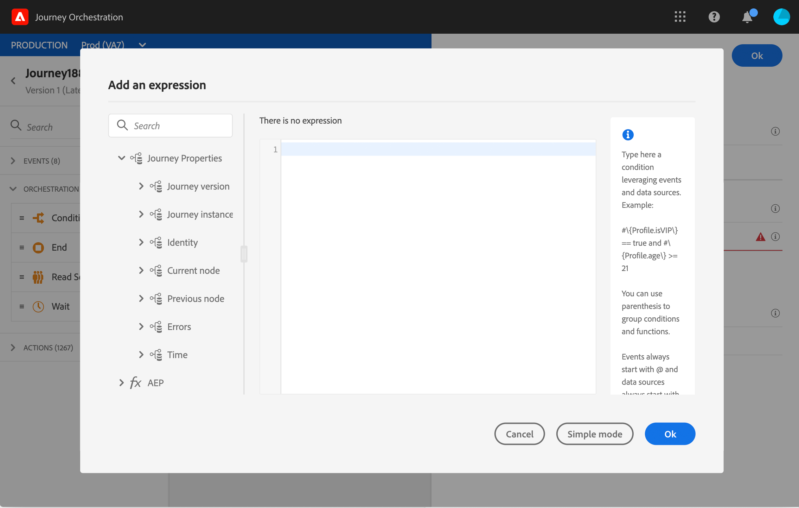

# 歷程屬性 {#journey-properties}

在進階運算式編輯器中，您會在事件與資 **料來源類別下** ，找到「歷程屬性」類別。 此類別包含與特定描述檔之旅程相關的技術欄位。 這是系統從即時歷程擷取的資訊，例如歷程ID或遇到的特定錯誤。

您將會找到有關以下內容的資訊：

* 歷程版本：journey uid、journey version uid、instance uid等。
* 錯誤：資料擷取、動作執行等。
* 當前步驟、最後一個當前步驟等。
* 捨棄的描述檔

您可以使用這些欄位來建立運算式。 在行程執行期間，將直接從行程中擷取值。

以下是一些使用案例的範例：

* **記錄已放棄的配置檔案**:您可以透過封閉規則，將所有已排除在訊息之外的描述檔傳送至第三方系統，以便進行記錄。 為此，您可以在逾時和錯誤的情況下設定路徑，並新增條件以篩選特定錯誤類型，例如：「封閉規則以捨棄人」。 然後，您可以透過自訂動作將已捨棄的描述檔推送至協力廠商系統。

* **在發生錯誤時傳送推播警報**:您可以在每次訊息發生錯誤時，傳送通知給第三方系統。 為此，您可以設定路徑以防發生錯誤，新增條件和自訂動作。 例如，您可以在Slack頻道上傳送通知，並說明所遇到的錯誤。

* **調整報表中的錯誤** :您可以針對錯誤類型定義條件，而不是只有一條錯誤訊息路徑。 這可讓您調整報表並檢視所有錯誤類型資料。

## 欄位清單 {#journey-properties-fields}

|類別|欄位名稱|標籤|說明|
|-|-|-|—|
Journey Version|journeyUID|Journey Identifier| |
| journeyVersionUID|Journey版本識別碼| |
| reyourmeVersionName|Journey版本名稱| |
| journeyVersionDescription|Journey版本說明| |
| journeyVersion|Journey Version| |
Journey Instance|instanceUID|Journey Instance Identifier|ID of the instance|
| |externalKey|External Key|觸發旅程的個別識別碼|
|Identity|profileId|描述檔識別碼|歷程中描述檔的識別碼|
| namespace|描述檔身分名稱空間|歷程中描述檔的名稱空間(範例：ECID)|
|當前節點|currentNodeId|當前節點標識符|當前活動（節點）的標識符|
| |currentNodeName|當前活動（節點）的當前節點名稱|名稱|
|上一個節點|previousNodeId|上一個節點標識符|上一個活動（節點）的標識符|
| |previousNodeName|上一個節點名稱|上一個活動（節點）的名稱|
|Errors|lastNodeUIDInError|Error中的最後一個節點標識符|Error中最新活動（節點）的標識符|
| |lastNodeNameInError|Error中的最後一個節點名稱|錯誤中最新活動（節點）的名稱|
| 錯誤中的|lastNodeTypeInError|錯誤中的最新活動（節點）的錯誤類型。 可能的類型：<ul><li>事件：事件、反應、SQ(例如：區段資格)</li><li>流量控制：結束、條件、等待</li><li>動作：ACS動作、跳轉、自訂動作</li></ul>|
| |lastErrorCode|Last Error Code|錯誤中最新活動（節點）的錯誤代碼。 可能的錯誤： <ul><li>HTTP錯誤代碼</li><li>限制</li><li>timedOut</li><li>錯誤(範例：預設值，以避免發生意外錯誤。 不應／極少發生)</li></ul>|
| |lastExecutedActionErrorCode|上次執行的動作錯誤代碼|錯誤中最新動作的錯誤代碼 |
| |lastDataFetchErrorCode|上次資料獲取錯誤代碼|從資料源獲取最新資料的錯誤代碼|
|Time|lastActionExecutionElapsedTime|上次操作執行已用時間|執行最新操作的花費時間|
| |lastDataFetchElapsedTime|上次資料獲取用時|執行來自資料源的最新資料獲取所花費的時間|
