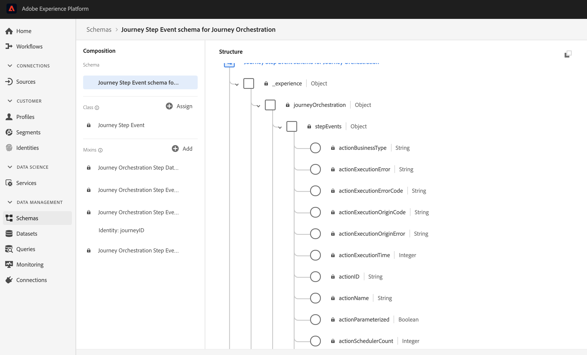

# 發行說明{#release-notes}

本頁面列出 Journey Orchestration 的所有新功能和改善項目。
您也可以參閱[文件更新](../release-notes/documentation-updates.md)。

## 2020年11月發行 {#november-release}

<table>
<thead>
<tr>
<th><strong>從一個旅程跳到另一個旅程</strong> </th>
</tr>
</thead>
<tbody>
<tr>
<td>

我們新增了一個動作活動，可讓您將個人從一個歷程推向另一個歷程。 「跳轉」活動允許您：

<ul>
<li>將複雜的旅程分割為數個旅程，以簡化複雜的旅程設計 </li>
<li>根據常見且可重複使用的歷程模式建立歷程</li>
</ul>

如需詳細資訊，請參閱<a href="../building-journeys/jump.md">相關的文件</a>，以瞭解詳情。

</td>
</tr>
</tbody>
</table>

<table>
<thead>
<tr>
<th><strong>在運算式編輯器中使用歷程屬性</strong> </th>
</tr>
</thead>
<tbody>
<tr>
<td>

在進階運算式編輯器中，我們在欄位和函式清單中新增了新類別。 這是系統從即時歷程擷取的資訊，例如歷程ID或遇到的特定錯誤。 這將為您提供更多建立旅程的可能性。 例如，您將能夠在條件或動作中遇到錯誤時提醒第三方系統。

請注意，此功能將於未來幾天提供。

如需詳細資訊，請參閱<a href="../expression/journey-properties.md">相關的文件</a>，以瞭解詳情。

</td>
</tr>
</tbody>
</table>

<table>
<thead>
<tr>
<th><strong>規則型事件 （測試版）</strong> </th>
</tr>
</thead>
<tbody>
<tr>
<td>

我們新增了一種方法，讓您更輕鬆地設定事件。 這項功能已透過Alpha計畫在有限的客戶群中測試過，現在已提供測試版給所有客戶。 此新方法不需要使用eventID。 它會評估事件是否應根據條件觸發。 您仍然可以使用現有的方法，現在稱為「系統產生」。

請注意，此功能將於未來幾天提供。

如需詳細資訊，請參閱<a href="../expression/journey-properties.md">相關的文件</a>，以瞭解詳情。

</td>
</tr>
</tbody>
</table>

### 其他改善項目{#october-november}

建立歷程的新版本時已增加限制。 這些限制可避免在歷程中發生過大的變更，以維持版本間的一致性。 [顯示全文](../about/limitations.md#journey-versions-limitations)

「區 **段資格** 」活動無法再用於包含「促銷活動標準」訊息活動的歷程中。 此限制可保護Adobe Campaign Standard例項的完整性。 事實上，「區段資格」的使用可能導致每日訊息傳送高峰，使「促銷活動標準交易訊息」超負荷。 [顯示全文](../about/limitations.md#segment-qualification)

## 2020年10月發行 {#october-release}

<table>
<thead>
<tr>
<th><strong>事件逾時</strong> </th>
</tr>
</thead>
<tbody>
<tr>
<td>

您現在可以設定事件的逾時，以便讓歷程僅在特定時間監聽事件。 您不再需要新增與事件路徑平行的「等待」活動來達成此目的。

如需詳細資訊，請參閱<a href="../building-journeys/event-activities.md#listening-to-events-during-a-specific-time">相關的文件</a>，以瞭解詳情。

</td>
</tr>
</tbody>
</table>

### 其他改善項目{#october-other}

* 當您發佈新版歷程時，舊版會自動結束並切換至「已關閉」狀態。 [顯示全文](../building-journeys/journey-versions.md)

## 2020年9月發行 {#september-release}

### GA 更新{#september-ga-update}

<table>
<thead>
<tr>
<th><strong>條件活動改進</strong> </th>
</tr>
</thead>
<tbody>
<tr>
<td>

在歷程中新增條件時，您現在可以定義標籤。 如果您在旅程中使用數個條件，這可讓您更輕鬆地識別這些條件。

如需詳細資訊，請參閱<a href="../building-journeys/condition-activity.md#about_condition">相關的文件</a>，以瞭解詳情。

</td>
</tr>
</tbody>
</table>

### Alpha 更新{#september-alpha-update}

若要探索 Alpha 的範圍，請參閱本[節](../alpha/alpha-overview.md)。

<table>
<thead>
<tr>
<th><strong>閱讀區段活動改進</strong> </th>
</tr>
</thead>
<tbody>
<tr>
<td>

The following improvements have been made to the <strong>Read segment</strong> activity:

<ul>
<li>
以區段為基礎的歷程現在會在畫布上方顯示，提醒您歷程的排程類型。 您可以按一下此提醒以存取排程設定功能表。

</li>
<li>
測試模式記錄檔的精細度已改良，可顯示區段匯出進度狀態。

</li>
</ul>

如需「閱讀」區段活 <strong>動的詳細資訊</strong> ，請參閱詳 <a href="../alpha/alpha-segment-trigger.md">細檔案</a>。

</td>
</tr>
</tbody>
</table>

## 2020 年 8 月發行 {#august-release}

### GA 更新{#august-ga-update}

「區段資格」事件的裝載現在包含下列內容資訊，您可在條件和動作中使用：行為（入口、出口）、資格的時間戳記及區段 ID。[顯示全文](../building-journeys/segment-qualification-events.md)

### Alpha 更新{#august-alpha-update}

若要探索 Alpha 的範圍，請參閱本[節](../alpha/alpha-overview.md)。

<table>
<thead>
<tr>
<th><strong>區段觸發器活動</strong> </th>
</tr>
</thead>
<tbody>
<tr>
<td>

已對「區段觸發器」活動進行下列改良：

<ul>
<li>
活動的名稱已變更為「閱讀區段」。 

</li>
<li>
已從活動屬性移除歷程排程器的設定。現在可直接從「歷程」的屬性存取，在專用區段中，將「閱讀區段」活動拖曳至畫布時，其就會顯示。 

</li>
<li>
您現在可以在單一設定檔上測試歷程，並使用視覺流量追蹤歷程的進度。

</li>
</ul>

如需詳細資訊，請參閱<a href="../alpha/alpha-segment-trigger.md">相關的文件</a>，以瞭解詳情。

</td>
</tr>
</tbody>
</table>

<table>
<thead>
<tr>
<th><strong>規則型事件</strong> </th>
</tr>
</thead>
<tbody>
<tr>
<td>

已對規則型事件進行下列改良：

<ul>
<li>
您現在可以運用您已擷取並串流至 Platform 的所有 Adobe Analytics 行為事件資料，以觸發歷程並自動化客戶體驗。<a href="../event/about-analytics.md">顯示全文</a>

</li>
<li>
在測試模式中觸發規則型事件時，您現在可以直接檢視事件 ID 條件。此外，規則評估的每個欄位旁都已新增工具提示。<a href="../building-journeys/testing-the-journey.md#test-rule-based">顯示全文</a>

</li>
<li>
規則型事件定義畫面已重新整理，進而改善體驗。<a href="../event/about-creating.md">顯示全文</a>

</li>
</ul>
</td>
</tr>
</tbody>
</table>

## Alpha 版- 2020 年 7 月 {#alpha-release---july-2020}

Alpha 方案提供目前在有限客戶群中進行測試的功能。這可讓我們根據收到的意見回饋來改良產品。並非所有 Journey Orchestration 客戶都能使用這些功能。

這些功能會在專屬章節中[說明](../alpha/alpha-overview.md)。

<table>
<thead>
<tr>
<th><strong>增強的使用者介面</strong> </th>
</tr>
</thead>
<tbody>
<tr>
<td>

為了提供與 Adobe Experience Platform 一致的介面，已增強 Journey Orchestration 功能表中的導覽功能：

<ul>
<li>
已將功能表從介面的上方移至左側。 

</li>
<li>
將管理功能分組至單一儀表板。

</li>
</ul>

如需詳細資訊，請參閱<a href="../alpha/alpha-interface.md">相關的文件</a>，以瞭解詳情。

</td>
</tr>
</tbody>
</table>

<table>
<thead>
<tr>
<th><strong>區段觸發器活動</strong> </th>
</tr>
</thead>
<tbody>
<tr>
<td>

「區段觸發」活動可讓您將屬於 Adobe Experience Platform 區段的所有個人進入歷程。進入歷程可以執行一次，也可以定期執行。<a href="../alpha/alpha-segment-trigger.md">顯示全文</a>

</td>
</tr>
</tbody>
</table>

<table>
<thead>
<tr>
<th><strong>規則型事件</strong> </th>
</tr>
</thead>
<tbody>
<tr>
<td>

我們已簡化設定 Experience 事件的方式。我們將推出不需要使用 eventID 的新方法。當您在 Journey Orchestration 中設定事件時，現在可以定義規則型活動。<a href="../event/about-events.md">顯示全文</a>

</td>
</tr>
</tbody>
</table>

## 第 2 季度發行 - 2020 年 6 月{#q2-release---june-2020}

<table>
<thead>
<tr>
<th><strong>Adobe Experience Platform 整合增強功能</strong> </th>
</tr>
</thead>
<tbody>
<tr>
<td>

已進行下列 Adobe Experience Platform 整合增強功能：

<ul>
<li>
新活動可監聽 Adobe Experience Platform 區段入口/出口，以便讓人員進入歷程或是在歷程中前進。<a href="../building-journeys/segment-qualification-events.md">顯示全文</a>

</li>
<li>
由於新的 <strong>Segments</strong> 索引標籤，現在無需離開 Journey Orchestration 介面，即可建立及編輯 Adobe Experience Platform 區段。<a href="../segment/about-segments.md">顯示全文</a>

</li>
<li>
在簡單運算式編輯器中，Adobe Experience Platform 區段現在會直接列在導覽樹狀結構中，以方便設定 "does this person belong to segment A?" 等條件。<a href="../segment/using-a-segment.md">顯示全文</a>

</li>
<li>
Journey Orchestration 現在會自動傳遞至 Adobe Experience Platform，在歷程中執行的步驟。這包含可能發生的錯誤。可藉由針對特定歷程或所有歷程的 Journey Step 事件執行查詢，而將此資訊用於實現報告及疑難排解。<a href="../building-journeys/sharing-overview.md">詳細內容</a>

</li>
<li>
現在可將 Journey Orchestration 連線至生產及非生產 Adobe Experience Platform 沙箱。請注意，沙箱是測試版功能。<a href="../about/access-management.md#sandboxes">詳細內容</a>

</li>
</ul>
</td>
</tr>
</tbody>
</table>

<table>
<thead>
<tr>
<th><strong>歷程設計程式與測試模式增強功能</strong> </th>
</tr>
</thead>
<tbody>
<tr>
<td>

已對歷程設計程式和測試模式進行下列增強功能：

<ul>
<li>
您現在可以選取 1 或 N 個歷程活動，而在歷程之間複製和貼上活動。<a href="../building-journeys/using-the-journey-designer.md#copy-paste">詳細內容</a>

</li>
<li>
在觸發事件而讓測試設定檔進入歷程後，您現在可以透過彩色視覺流程，而瞭解其在歷程中的進度。在歷程中發生錯誤時，也會顯示錯誤的詳細資料。<a href="../building-journeys/testing-the-journey.md#firing_events">詳細內容</a>

</li>
<li>已將 <strong>Finished</strong> 歷程重新命名為 <strong>Closed (no entrance)</strong>，以便更妥善地反映此狀態代表的意義。</li>
</ul>
</td>
</tr>
</tbody>
</table>

**其他改善項目**

為了避免傳送過多 API 呼叫至協力廠商系統，我們推出新的公用 API 來設定 &quot;capping&quot; 規則。上限規則可定義每毫秒對 API 端點的呼叫數量上限。[詳細內容](../api/capping.md)

存取控制現在可以更精細地管理使用者的存取權限。生效日期：2020 年 6 月 30 日。[詳細內容](../about/access-management.md#create-product-profile)

Journey Orchestration 現在已於 APAC（澳洲資料中心）推出。生效日期：2020 年 6 月 30 日

Journey Orchestration　介面提供日文版。

## 第 1 季發行 - 2020 年 3 月{#q1-release---march-2020}

<table>
<thead>
<tr>
<th><strong>測試模式增強功能</strong> </th>
</tr>
</thead>
<tbody>
<tr>
<td>

測試模式已進行下列增強：

<ul>
<li>如果歷程使用數個事件，您現在可以在測試模式的<strong>「事件設定」</strong>畫面中，從下拉式清單中個別觸發每個事件。<a href="../building-journeys/testing-the-journey.md#firing_events">詳細內容</a>
</li>
<li>
如果歷程中使用一或多個<strong>「等待」</strong>活動，您現在可以定義每個活動在測試模式中的持續時間。預設時間為 10 秒。您可以使用左下角的<strong>「測試等待時間」</strong>參數來變更此項目。<a href="../building-journeys/testing-the-journey.md">詳細內容</a>

</li>
<li>在<strong>測試記錄</strong>中，如果在呼叫協力廠商系統 (資料來源或動作) 時發生錯誤，現在會顯示錯誤代碼和錯誤回應。<a href="../building-journeys/testing-the-journey.md#viewing_logs">詳細內容</a>
</li>
</ul>
</td>
</tr>
</tbody>
</table>

<table>
<thead>
<tr>
<th><strong>集中式時區管理</strong> </th>
</tr>
</thead>
<tbody>
<tr> 
<td>

時區管理現已集中在歷程屬性面板中。已在歷程屬性中新增兩個參數：

<ul>
<li><strong>「時區」</strong>下拉式清單可讓您選取特定時區。依預設，系統會使用瀏覽器的時區。 </li>
<li><strong>「設定檔時區」</strong>核取方塊可讓您使用進入歷程之人員的 Adobe Experience Platform 設定檔時區（若有）。否則，系統會使用下拉式清單中定義的時區。此功能與使用沒有命名空間之事件的歷程不相容。</li>
</ul>

如需詳細資訊，請參閱<a href="../building-journeys/changing-properties.md#timezone">變更屬性</a>和<a href="../building-journeys/timezone-management.md">時區管理</a>區段。

</td>
</tr>
</tbody>
</table>

<table>
<thead>
<tr>
<th><strong>歷程設計器增強功能</strong> </th>
</tr>
</thead>
<tbody>
<tr> 
<td>

已增強歷程設計器左側的<strong>浮動視窗</strong>：

<ul>
<li><strong>搜尋</strong>列旁的新圖示可讓您隱藏或顯示浮動視窗中無法使用的元素，例如使用與歷程所用不同之命名空間的事件。依預設，系統會隱藏無法使用的項目。</li>
<li>使用<strong>搜尋</strong>欄位時，現在會顯示每個畫布活動類別的結果數量。</li>
<li>改善不同活動類別之間的導覽。</li>
</ul>

在歷程設計器中，您現在可以檢查自己是否存取最新的歷程版本。此資訊會顯示在版本編號旁邊。

在歷程<strong>畫布</strong>中，當兩個活動中斷連結時，現在會顯示警告訊息。

如需詳細資訊，請參閱<a href="../building-journeys/using-the-journey-designer.md">詳細文件</a>。

</td>
</tr>
</tbody>
</table>

<table>
<thead>
<tr>
<th><strong>內容說明</strong> </th>
</tr>
</thead>
<tbody>
<tr>
<td>

不同的 Journey Orchestration 清單畫面（歷程、事件、動作和資料來源）現在都會提供內容說明。這可讓您檢視目前功能的快速說明，並存取相關文章和影片。

若要顯示內容說明，請按一下畫面右上方的  圖示。 

</td>
</tr>
</tbody>
</table>

**其他改善項目**

* 除了美國以外，Journeys Orchestration 現在已於&#x200B;**歐洲、中東及非洲 (EMEA)**&#x200B;推出。應用程式和文件提供法文版和德文版。

* Experience League 現在已整合至產品中。這可簡化對相關內容的存取，並協助您充分運用 Experience Cloud 的功能。可在 Help 索引標籤底部直接存取 Journey Orchestration 文件。此外，按一下 Help > Feedback 即可報告問題，或與 Adobe 分享您的想法。

* 現在，所有清單畫面（歷程、資料來源、動作和事件）都可以使用 **C** 鍵盤快速鍵來建立新項目。[詳細內容](../about/user-interface.md#section_ksq_zr1_ffb)

* 您現在可以&#x200B;**刪除**&#x200B;已停止的歷程。系統不會再提供與這些已刪除歷程相關聯的報告。

* 瀏覽 **Adobe Experience Platform 欄位**（XDM 格式）時，您現在除了看到欄位名稱外，還會看到顯示名稱。此資訊會從「Experience 資料模型」的結構定義中擷取。當可用時，畫面就會出現替代顯示名稱。這種容易理解的說明在 eVar 欄位中特別有用，可讓您更輕鬆地識別欄位。[詳細內容](../about/user-interface.md#friendly-names-display)

## 正式發行 - 2019 年 12 月{#ga-release---december-2019}

Journey Orchestration 現在已正式推出。

善用儲存在事件或資料來源中的情境資料，建立即時協調使用案例。

Journey Orchestration 能以事件中的情境資料、Adobe Experience Platform 的資訊或來自協力廠商 API 服務的資料，進行即時協調。應用程式會根據消費者的個人檔案和行為，在稱為歷程的多步驟流程中，決定對該消費者來說下一個最佳的動作。這包括最佳時機和動作類型，例如透過 Adobe Campaign Standard 交易訊息功能（需要有 Adobe Campaign Standard）向消費者傳送推播通知或來自協力廠商系統的通知。這些決定是依據規則和 Sensei 分數加以制定。

[進一步瞭解](../action/working-with-adobe-campaign.md) Journey Orchestration。

其他資源：

* [教學課程](https://docs.adobe.com/content/help/zh-Hant/journey-orchestration-learn/tutorials/understanding-journey-orchestration.html)
* [社群](https://www.adobe.com/go/journeyorchestrationcommunity)
