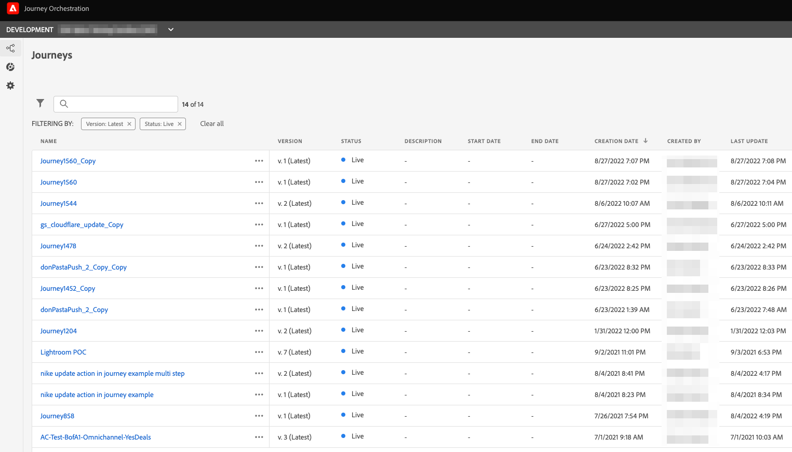
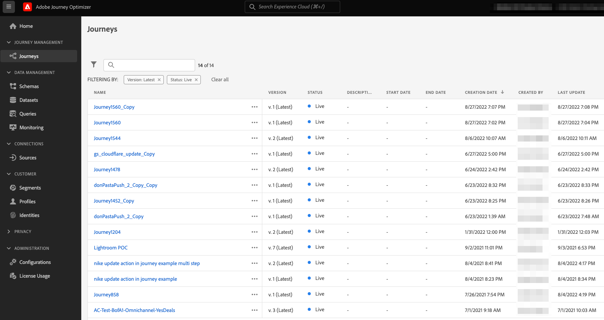
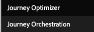

# 將您的Journey Orchestration環境升級至Adobe Journey Optimizer{#ugrade-ajo}

## 什麼是Adobe Journey Optimizer？

Adobe Journey Optimizer是原生建置在Adobe Experience Platform上的敏捷且可擴充的應用程式，可跨任何應用程式、裝置、畫面或頻道，協調及提供個人化、連線且及時的客戶歷程&#x200B;。

## 什麼是Journey Orchestration？

Journey Orchestration是一項建構在Adobe Experience Platform上的服務，可讓您根據每位客戶先前的行為和偏好設定量身打造個別的歷程。 Journey Orchestration是Journey Optimizer的前身應用程式。

## 為何要改用Adobe Journey Optimizer？

**存取簡化的介面**，其中的Experience Platform功能可讓您快速存取歷程、資料集、設定檔、警報等等。 您不必再在Adobe Experience Platform和Journey Orchestration之間來回切換即可存取結構描述或資料集，Adobe Journey Optimizer提供一切直接服務。 如需詳細資訊，請參閱此[頁面](https://experienceleague.adobe.com/docs/journey-optimizer/using/get-started/user-interface.html)。

<table>
<tr>
<th>早於</th>
<th>晚於</th>
</tr>
<tr>
<td>
存取Journey Orchestration中的歷程、區段和管理員區段（資料來源、事件和動作）。 可在Adobe Experience Platform中存取區段和資料集。 
</td>
<td>
在Adobe Journey Optimizer</strong>中存取歷程、區段、管理員、區段和資料集<strong>全部。 <strong>此處也提供其他Adobe Experience Platform功能</strong>。
</td>
</tr>
</table>

**新報告介面**&#x200B;以及新報告功能的存取權：

<table>
<tr>
<th>早於</th>
<th>晚於</th>
</tr>
<tr>
<td></td>
<td>
<strong>全域檢視</strong>可讓您測量選定時段內歷程與傳遞的影響。 如需更多即時量度，您可以存取<strong>即時檢視</strong>。 對於您的歷程中使用的每個傳遞管道（電子郵件、簡訊、推播），報表中都會提供<strong>專屬區段</strong>來檢視量度。 只有使用現成可用的<strong>Adobe Journey Optimizer訊息功能</strong>時，才適用。 如需詳細資訊，請洽詢您的帳戶團隊。
</td>
</tr>
</table>

改善報告體驗或在新功能發行後使其豐富的任何演變，都只能在新的報告介面上使用。 開始使用它以取得更完整的Adobe Journey Optimizer體驗。

取得其他目前&#x200B;**Adobe Journey Optimizer功能**&#x200B;以及即將推出的新功能（例如欄位層級存取控制和物件層級存取控制）的優點。 如需詳細資訊，請洽詢您的帳戶團隊。

## 如何升級我的Journey Orchestration環境？

1. 請洽詢您的客戶團隊，更新您與Adobe的合約。

1. 請等待我們的工程團隊完成變更。

1. 使用Journey Optimizer的產品設定檔更新您的許可權。 請參閱此[頁面](https://experienceleague.adobe.com/docs/journey-optimizer/using/administration/ootb-product-profiles.html?lang=zh-Hant)。

1. 您現在可以存取Adobe Journey Optimizer了！

## 常見問答

### 我需要規劃從Journey Orchestration移至Adobe Journey Optimizer的任何專案嗎？

不，您無需進行移轉，無需執行任何工作，無需停機，也不需額外投資。 您只需要更新您與Adobe的合約，我們就會完成其餘工作。 如需如何啟動此程式的指示，請聯絡您的客戶代表。

### 變更後我會遺失一些東西嗎？

否，您將保留所有現有的Journey Orchestration和Adobe Experience Platform物件：結構描述、資料集、歷程、事件、資料來源、動作。 不會遺失任何內容，所有即時歷程將繼續運作而不會中斷。

<table>
<tr>
<th>早於</th>
<th>晚於</th>
</tr>
<tr>
<td></td>
<td></td>
</tr>
</table>

### 我仍然在應用程式切換器中看到Journey Orchestration，它正常嗎？

是的，這是正常的。 在升級後的幾天內，您仍可能會看到Journey Orchestration專案。 請使用Journey Optimizer one。

### 如果我將Journey Orchestration與Adobe Campaign Standard搭配使用，會發生什麼事？

移至Adobe Journey Optimizer後，您仍可在Adobe Journey Optimizer中設計客戶歷程並讓Adobe Campaign Standard傳送傳遞，以使用Journeys與Adobe Campaign Standard之間的整合。

但由於Adobe Journey Optimizer報告棧疊的運作方式，報告不會結合歷程和Campaign Standard資料。 歷程資訊可在Adobe Journey Optimizer報表中取得，也可在Adobe Campaign Standard中取得傳送資訊。 可以進行Experience Platform設定以將Adobe Campaign Standard資料帶回Adobe Experience Platform，使其可供Customer Journey Analytics（[瞭解更多](https://business.adobe.com/products/experience-platform/customer-journey-analytics.html)）或其他第三方報告工具（例如Tableau或PowerBI）使用。

使用Adobe Journey Optimizer現成的傳訊功能時，Adobe Journey Optimizer報表的運作最佳化(可在專屬的Adobe Journey Optimizer方案中取得)。 如需如何在歷程畫布中編寫訊息的詳細資訊，請參閱此[頁面](https://experienceleague.adobe.com/docs/journey-optimizer/using/messages/messages-in-journeys.html)。

如需詳細資訊，請洽詢您的帳戶團隊。
