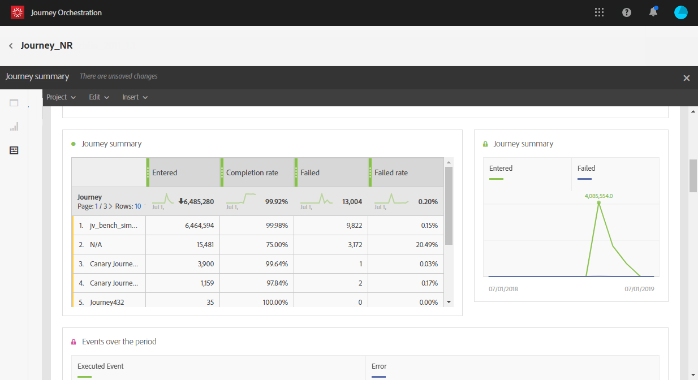

# 關於歷程報告 {#concept_rfj_wpt_52b}

>[!NOTE]
>
>只有在您有Adobe Campaign Standard時，才會填入傳送資料和區段元件。

本節將介紹如何存取和使用報告來評估您的歷程成效。

## 報告介面 {#reporting-interface}

例如，頂端工具列可讓您修改、儲存或列印報表。

使用標 **[!UICONTROL Project]** 簽可以：

* **[!UICONTROL Open]**:開啟先前建立的報表或範本。
* **[!UICONTROL Save As]**:複製範本，以便修改範本。
* **[!UICONTROL Refresh project]**:根據新資料和篩選條件變更來更新您的報表。
* **[!UICONTROL Download CSV]**:將報表匯出為CSV檔案。
* **[!UICONTROL Print]**:列印您的報表。

該選 **[!UICONTROL Edit]** 項卡允許您：

* **[!UICONTROL Undo]**:取消控制面板上的最後動作。
* **[!UICONTROL Redo]**:取消控制面 **[!UICONTROL Undo]** 板上的最後動作。
* **[!UICONTROL Clear all]**:刪除控制面板上的每個面板。

此表 **[!UICONTROL Insert]** 格可讓您將圖形和表格新增至控制面板，以自訂報表：

* **[!UICONTROL New Blank Panel]**:新增空白麵板至控制面板。
* **[!UICONTROL New Freeform]**:新增自由表格至控制面板。
* **[!UICONTROL New Line]**:新增折線圖至控制面板。
* **[!UICONTROL New Bar]**:新增長條圖至控制面板。

左側標籤可讓您建立報表並視需要篩選資料。

這些標籤可讓您存取下列項目：

* **[!UICONTROL Panels]**:新增空白麵板或自由格式至報表，以開始篩選資料。 For more on this, refer to the [Adding panels](../reporting/creating-your-journey-reports.md#adding-panels) section
* **[!UICONTROL Visualizations]**:拖放一系列視覺化項目，讓您的報表擁有圖形維度。 For more on this, refer to the [Adding visualizations](../reporting/creating-your-journey-reports.md#adding-visualizations) section.
* **[!UICONTROL Components]**:使用不同的維度、量度、區段和時段自訂報表。 For more on this, refer to the [Adding components](../reporting/creating-your-journey-reports.md#adding-components) section.

## 歷程摘要範本 {#ootb-template}

報表分為兩類：立即可用的範本和自訂報表。
現成可用的範本可讓您 **[!UICONTROL Journey summary]**&#x200B;清楚檢視最重要的追蹤資料。

每個表都由摘要數字和圖表表示。 您可以變更詳細資訊在其各自視覺化設定中的顯示方式。

報表頂端提供下列KPI:

* **[!UICONTROL Journey - Entered]**:到達旅程入門活動的總人數。
* **[!UICONTROL Journey - Completion rate]**:到達旅程結束的個人總數（或當個人不符合任何條件時）與進入旅程的個人總數之比。
* **[!UICONTROL Journey - Current]**:目前在旅程中的個人總數。
* **[!UICONTROL Journey - Failed rate]**:未成功執行的歷程總數與執行歷程的次數比較。
* **[!UICONTROL Delivery - Messages sent]**:已發送的消息總數。
* **[!UICONTROL Delivery rate]**:成功傳送的訊息總數與傳送的訊息相比較。
* **[!UICONTROL Delivery - Bounce rate]**:與已發送的消息相比，被跳回的消息總數。
* **[!UICONTROL Delivery - Unsubscribed rate]**:收件者與已傳送訊息相比的未訂閱總數。
* **[!UICONTROL Delivery - Open rate]**:已開啟的消息總數與已發送消息的數目相比。
* **[!UICONTROL Delivery - Click rate]**:傳送中的點按總數，與傳送訊息的數目相比。

「歷程流量」視覺化可讓您逐步瞭解您的目標描述檔路徑。 這僅適用於定位單一歷程時。 它會自動產生，無法修改。

表格 **[!UICONTROL Journey summary]** 包含您歷程的可用資料，例如：

* **[!UICONTROL Entered]**:到達旅程入門活動的總人數。
* **[!UICONTROL Completion rate]**:到達行程結束流量控制的個人總數與進入行程的個人總數之比。
* **[!UICONTROL Current]**:目前在旅程中的個人總數。
* **[!UICONTROL Failed]**:未成功執行的歷程總數。
* **[!UICONTROL Failed rate]**:未成功執行的歷程總數與執行歷程的次數比較。

表格 **[!UICONTROL Top events]** 顯示您歷程中最成功的 **[!UICONTROL Top action]**&#x200B;事件和最成功的動作。

表格 **[!UICONTROL Delivery - Sending summary]** 包含您歷程傳送的可用資料，例如：

* **[!UICONTROL Processed/sent]**:已發送的消息總數。
* **[!UICONTROL Delivered rate]**:成功傳送的訊息總數與傳送的訊息相比較。
* **[!UICONTROL Delivered]**:成功發送的消息數，與已發送消息總數相關。
* **[!UICONTROL Bounce + error rate]**:與已發送的消息相比，被跳回的消息總數。
* **[!UICONTROL Bounces + errors]**:傳送和自動傳回處理期間累積的錯誤總數，與已傳送訊息總數相關。

表格 **[!UICONTROL Delivery - Tracking summary]** 包含可用來追蹤您歷程傳送成功的資料，例如：

* **[!UICONTROL Open Rate]**:已開啟留言的百分比。
* **[!UICONTROL Open]**:傳送中訊息開啟的次數。
* **[!UICONTROL Click trough rate]**:傳送中的點按總數，與傳送訊息的數目相比。
* **[!UICONTROL Click]**:內容在傳送中被點按的次數。
* **[!UICONTROL Unsubscribe rate]**:收件者未訂閱與已傳送訊息的百分比。
* **[!UICONTROL Unsubscribed]**:收件者與已傳送訊息相比的未訂閱總數。
