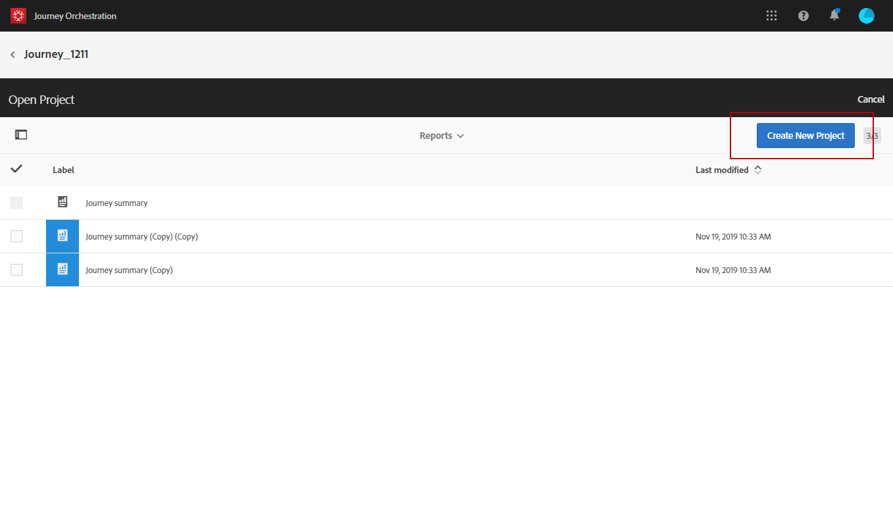

# 建立您的歷程報告 {#concept_rfj_wpt_52b}

## 存取和建立報告 {#accessing-reports}

>[!NOTE]
>
>刪除歷程後，所有關聯報告將無法再使用。

本節將介紹如何建立或使用現成可用的報表。 結合面板、元件和視覺效果，以便更妥善地追蹤您的歷程是否成功。

若要存取歷程報告並開始追蹤傳送成功，請執行下列動作：

1. 在頂端功能表中，按一下 **[!UICONTROL Home]** 索引標籤。

1. 選取您要報告的歷程。

   請注意，您也可以按一下 **報告** 將滑鼠懸停在歷程清單中的歷程上時。

   

1. 按一下 **[!UICONTROL Report]** 圖示加以檢視。

   

1. 此 **[!UICONTROL Journey summary]** 現成的報告會出現在畫面上。 若要存取自訂報表，請按一下 **[!UICONTROL Close]** 按鈕。

   

1. 按一下 **[!UICONTROL Create new project]** 以從頭開始建立報表。

   

1. 從 **[!UICONTROL Panels]** 標籤，視需要拖放任意數量的面板或自由表格。 如需詳細資訊，請參閱此 [區段](#adding-panels).

   

1. 然後，您可以透過拖放以下專案的維度和量度來開始篩選資料： **[!UICONTROL Components]** 定位至您的自由表格。 如需詳細資訊，請參閱此 [區段](#adding-components).

   

1. 若要更清楚瞭解您的資料，您可以透過以下連結新增視覺效果： **[!UICONTROL Visualizations]** 標籤。 如需詳細資訊，請參閱此 [區段](#adding-visualizations).

## 新增面板{#adding-panels}

### 新增空白面板 {#adding-a-blank-panel}

若要啟動報表，您可以將一組面板新增至現成可用的或自訂報表。 每個面板都包含不同的資料集，由自由表格和視覺效果組成。

此面板可讓您視需要建置報表。 您可以在報表中新增任意數量的面板，以使用不同的時段篩選資料。

1. 按一下 **[!UICONTROL Panels]** 圖示。您也可以按一下 **[!UICONTROL Insert tab]** 並選取 **[!UICONTROL New Blank Panel]**.

   

1. 拖放 **[!UICONTROL Blank Panel]** 放入您的儀表板。

   

您現在可以將自由表格新增至面板，以開始鎖定目標資料。

### 新增自由表格 {#adding-a-freeform-table}

自由表格可讓您建立表格，以使用中提供的不同量度和維度來分析您的資料。 **[!UICONTROL Component]** 表格。

每個表格和視覺效果皆可調整大小，並可移動以自訂報表。

1. 按一下 **[!UICONTROL Panels]** 圖示。

   

1. 拖放 **[!UICONTROL Freeform]** 個專案放入您的儀表板。

   您也可以按一下 **[!UICONTROL Insert]** 標籤並選取 **[!UICONTROL New Freeform]** 或按一下 **[!UICONTROL Add a freeform table]** 在空白面板中。

   

1. 從拖放專案 **[!UICONTROL Components]** 定位至欄和列，以建置您的表格。

   

1. 按一下 **[!UICONTROL Settings]** 圖示來變更資料在欄中的顯示方式。

   

   此 **[!UICONTROL Column settings]** 由下列專案組成：

   * **[!UICONTROL Number]**：可讓您顯示或隱藏欄中的摘要數字。
   * **[!UICONTROL Percent]**：可讓您顯示或隱藏欄中的百分比。
   * **[!UICONTROL Interpret zero as no value]**：可讓您在值等於零時顯示或隱藏。
   * **[!UICONTROL Background]**：可讓您顯示或隱藏儲存格中的水準進度列。
   * **[!UICONTROL Include retries]**：可讓您在結果中包含重試。 此專案僅適用於 **[!UICONTROL Sent]** 和 **[!UICONTROL Bounces + Errors]**.

1. 選取一或多個列，然後按一下 **[!UICONTROL Visualize]** 圖示。 新增視覺效果以反映您選取的列。

   

您現在可以視需要新增任意數量的元件，也可以新增視覺效果以提供資料的圖形表示。

## 新增元件{#adding-components}

元件可協助您使用不同的維度、量度和時段來自訂報表。

1. 按一下 **[!UICONTROL Components]** 標籤以存取元件清單。

   

1. 每個類別都會顯示在 **[!UICONTROL Components]** 索引標籤顯示五個最常用的專案，按一下類別名稱即可存取其完整的元件清單。

   元件表格分為三個類別：

   * **[!UICONTROL Dimensions]**：從傳送記錄檔取得詳細資料，例如收件者的瀏覽器或網域，或傳送成功。
   * **[!UICONTROL Metrics]**：取得訊息狀態的詳細資訊。 例如，已傳遞訊息且使用者已開啟該訊息。
   * **[!UICONTROL Time]**：設定表格的時段。

1. 將元件拖放至面板中，即可開始篩選資料。

您可以視需要拖放任意數量的元件，並相互比較。

## 新增視覺效果{#adding-visualizations}

此 **[!UICONTROL Visualizations]** tab可讓您拖放視覺效果專案，例如區域、環圈圖和圖表。 視覺效果可提供資料的圖形化表示。

1. 在 **[!UICONTROL Visualizations]** 標籤，將視覺效果專案拖放至面板中。

   

1. 將視覺效果新增至面板後，您的報表會自動偵測自由表格中的資料。 選取視覺效果的設定。
1. 如果您有多個自由表格，請在的圖表中選擇可用的資料來源 **[!UICONTROL Data Source Settings]** 視窗。 按一下視覺效果標題旁的彩色點，即可使用此視窗。

   

1. 按一下 **[!UICONTROL Visualization]** 設定按鈕，直接變更圖表型別或顯示的內容，例如：

   * **[!UICONTROL Percentages]**：以百分比顯示值。
   * **[!UICONTROL Anchor Y Axis at Zero]**：即使值的範圍在零以上，也強制將y軸設為零。
   * **[!UICONTROL Legend visible]**：可讓您隱藏圖例。
   * **[!UICONTROL Normalization]**：強制值相符。
   * **[!UICONTROL Display Dual Axis]**：將另一個軸新增至圖表。
   * **[!UICONTROL Limit Max Items]**：限制顯示的圖表數量。
   * **[!UICONTROL Threshold]**：可讓您設定圖表的臨界值。 它會顯示為黑色虛線。

   

此視覺效果可讓您在報表中更清楚地檢視資料。
