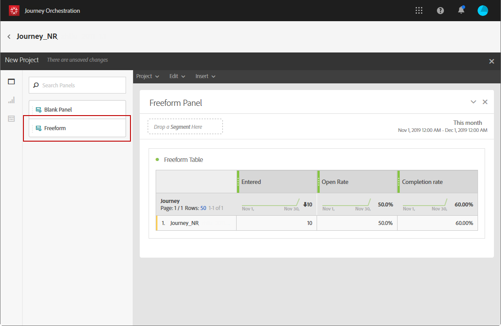

# 建立您的歷程報告 {#concept_rfj_wpt_52b}

## 訪問和建立報告 {#accessing-reports}

>[!NOTE]
>
>刪除行程後，所有關聯的報告將不再可用。

本節將介紹如何建立或使用現成報告。 將面板、元件和可視化結合起來，以更好地跟蹤您的旅程成功。

要訪問您的行程報告並開始跟蹤交付成功：

1. 在頂端功能表中，按一下 **[!UICONTROL Home]** 索引標籤。

1. 選擇要報告的行程。

   請注意，您也可以通過按一下 **報告** 在旅行清單上徘徊。

   

1. 按一下 **[!UICONTROL Report]** 表徵圖。

   

1. 的 **[!UICONTROL Journey summary]** 螢幕上顯示「out-of-the-of-the report（出廠報告）」。 要訪問自定義報告，請按一下 **[!UICONTROL Close]** 按鈕

   

1. 按一下 **[!UICONTROL Create new project]** 從頭開始建立報表。

   

1. 從 **[!UICONTROL Panels]** 頁籤，根據需要拖放任意多個面板或自由形式表。 有關詳細資訊，請參閱 [節](#adding-panels)。

   

1. 然後，可以通過從 **[!UICONTROL Components]** 頁籤。 有關詳細資訊，請參閱 [節](#adding-components)。

   

1. 要更清楚地查看資料，可以從 **[!UICONTROL Visualizations]** 頁籤。 有關詳細資訊，請參閱 [節](#adding-visualizations)。

## 新增面板{#adding-panels}

### 添加空白麵板 {#adding-a-blank-panel}

要啟動報告，可以將一組面板添加到現成或自定義報告中。 每個面板包含不同的資料集，由自由形式表和可視化組成。

此面板允許您根據需要生成報告。 您可以在報告中添加任意數量的面板，以便按不同的時段篩選資料。

1. 按一下 **[!UICONTROL Panels]** 圖示。也可以通過按一下 **[!UICONTROL Insert tab]** 選擇 **[!UICONTROL New Blank Panel]**。

   

1. 拖放 **[!UICONTROL Blank Panel]** 你的儀錶盤。

   

現在，您可以向面板中添加自由格式表以開始目標資料。

### 添加自由形式表 {#adding-a-freeform-table}

自由形式表允許您建立表，以使用中提供的不同度量和維來分析資料 **[!UICONTROL Component]** 的子菜單。

每個表和可視化都可調整大小，可以移動以更好地定制報告。

1. 按一下 **[!UICONTROL Panels]** 圖示。

   

1. 拖放 **[!UICONTROL Freeform]** 項目。

   也可以通過按一下 **[!UICONTROL Insert]** 頁籤 **[!UICONTROL New Freeform]** 或 **[!UICONTROL Add a freeform table]** 的子菜單。

   

1. 從 **[!UICONTROL Components]** 頁籤。

   

1. 按一下 **[!UICONTROL Settings]** 表徵圖以更改資料在列中的顯示方式。

   

   的 **[!UICONTROL Column settings]** 由下列組成：

   * **[!UICONTROL Number]**:用於顯示或隱藏列中的摘要數字。
   * **[!UICONTROL Percent]**:允許您顯示或隱藏列中的百分比。
   * **[!UICONTROL Interpret zero as no value]**:允許在值等於零時顯示或隱藏。
   * **[!UICONTROL Background]**:用於顯示或隱藏單元格中的水準進度條。
   * **[!UICONTROL Include retries]**:允許您在結果中包括重試。 僅適用於 **[!UICONTROL Sent]** 和 **[!UICONTROL Bounces + Errors]**。

1. 選擇一行或多行，然後按一下 **[!UICONTROL Visualize]** 表徵圖 將添加一個可視化，以反映您選擇的行。

   

現在，您可以根據需要添加盡可能多的元件，還可以添加可視化效果，以提供資料的圖形表示。

## 新增元件{#adding-components}

元件可幫助您使用不同的維度、度量和時段自定義報表。

1. 按一下 **[!UICONTROL Components]** 頁籤。

   

1. 在 **[!UICONTROL Components]** 頁籤顯示五個最常用的項，按一下類別名稱以訪問其元件的完整清單。

   元件表分為三類：

   * **[!UICONTROL Dimensions]**:從遞送日誌（如收件人的瀏覽器或域）獲取詳細資訊，或者遞送成功。
   * **[!UICONTROL Metrics]**:獲取有關消息狀態的詳細資訊。 例如，如果傳遞了消息，並且用戶開啟了該消息。
   * **[!UICONTROL Time]**:為表設定時間段。

1. 拖放面板中的元件以開始篩選資料。

您可以根據需要拖放任意多個元件，並將它們相互比較。

## 新增視覺效果{#adding-visualizations}

的 **[!UICONTROL Visualizations]** 頁籤中，您可以拖放可視化項目，如區域、圓環和圖形。 可視化功能可以為您提供資料的圖形表示。

1. 在 **[!UICONTROL Visualizations]** 頁籤，在面板中拖放可視化項目。

   

1. 將可視化添加到面板後，報表將自動檢測自由形式表中的資料。 選擇可視化設定。
1. 如果有多個自由形式表，請選擇要添加到圖形中的可用資料源 **[!UICONTROL Data Source Settings]** 的子菜單。 通過按一下可視化標題旁邊的彩色點，也可以使用此窗口。

   

1. 按一下 **[!UICONTROL Visualization]** 設定按鈕以直接更改圖形類型或其上顯示的內容，例如：

   * **[!UICONTROL Percentages]**:以百分比顯示值。
   * **[!UICONTROL Anchor Y Axis at Zero]**:即使值範圍大於零，也強制y軸為零。
   * **[!UICONTROL Legend visible]**:讓你隱藏圖例。
   * **[!UICONTROL Normalization]**:強制值匹配。
   * **[!UICONTROL Display Dual Axis]**:將另一個軸添加到圖形中。
   * **[!UICONTROL Limit Max Items]**:限制顯示的圖形數。
   * **[!UICONTROL Threshold]**:用於為圖形設定閾值。 它顯示為黑色虛線。

   

此可視化功能使您能夠更清楚地查看報告中的資料。
