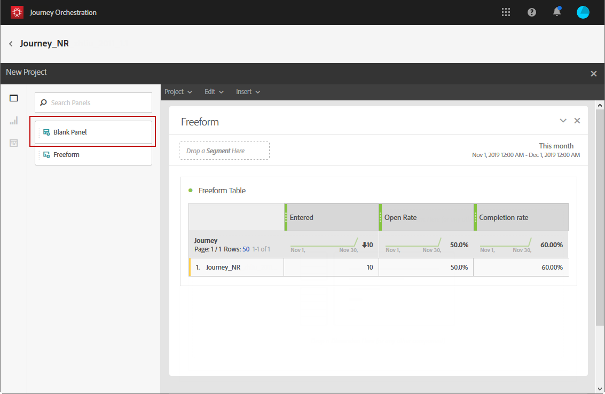

# 建立您的歷程報告 {#concept_rfj_wpt_52b}

## 存取及建立報表 {#accessing-reports}

>[!NOTE]
>
>刪除歷程後，將無法再使用所有相關的報表。

本節將說明如何建立或使用現成可用的報表。 結合面板、元件和視覺效果，以更妥善地追蹤歷程的成功。

若要存取您的歷程報表，並開始追蹤傳送的成功：

1. 在頂端功能表中，按一下 **[!UICONTROL Home]** 索引標籤。

1. 選取您要報告的歷程。

   請注意，您也可以按一下 **報表** 在歷程清單中暫留於歷程時。

   

1. 按一下 **[!UICONTROL Report]** 圖示。

   

1. 此 **[!UICONTROL Journey summary]** 「現成」報表會顯示在畫面上。 若要存取自訂報表，請按一下 **[!UICONTROL Close]** 按鈕。

   

1. 按一下 **[!UICONTROL Create new project]** 從草稿開始建立報表。

   

1. 從 **[!UICONTROL Panels]** 標籤，視需要拖放多個面板或自由表格。 如需詳細資訊，請參閱 [節](#adding-panels).

   

1. 接著，您可以從 **[!UICONTROL Components]** 標籤。 如需詳細資訊，請參閱 [節](#adding-components).

   

1. 若要更清楚地檢視您的資料，您可以從 **[!UICONTROL Visualizations]** 標籤。 如需詳細資訊，請參閱 [節](#adding-visualizations).

## 新增面板{#adding-panels}

### 新增空白麵板 {#adding-a-blank-panel}

若要啟動報表，您可以新增一組面板至現成可用或自訂報表。 每個面板包含不同的資料集，且由自由表格和視覺效果組成。

此面板可讓您視需要建立報表。 您可以在報表中新增任意數量的面板，以便依不同的時段篩選資料。

1. 按一下 **[!UICONTROL Panels]** 圖示。您也可以按一下 **[!UICONTROL Insert tab]** 選取 **[!UICONTROL New Blank Panel]**.

   

1. 拖放 **[!UICONTROL Blank Panel]** 進入控制面板。

   

您現在可以新增自由表格至面板，以開始鎖定目標資料。

### 新增自由表格 {#adding-a-freeform-table}

自由表格可讓您建立表格，以使用 **[!UICONTROL Component]** 表格。

每個表格和視覺效果都可調整大小，並可移動以更妥善地自訂報表。

1. 按一下 **[!UICONTROL Panels]** 圖示。

   

1. 拖放 **[!UICONTROL Freeform]** 項目放入控制面板中。

   您也可以按一下 **[!UICONTROL Insert]** 標籤和選取 **[!UICONTROL New Freeform]** 或 **[!UICONTROL Add a freeform table]** 填入空白麵板。

   

1. 從 **[!UICONTROL Components]** 索引標籤至欄和列，以建立表格。

   

1. 按一下 **[!UICONTROL Settings]** 圖示來變更資料在欄中的顯示方式。

   

   此 **[!UICONTROL Column settings]** 是由下列項目組成：

   * **[!UICONTROL Number]**:可讓您顯示或隱藏欄中的摘要數字。
   * **[!UICONTROL Percent]**:可讓您顯示或隱藏欄中的百分比。
   * **[!UICONTROL Interpret zero as no value]**:可讓您在值等於零時顯示或隱藏。
   * **[!UICONTROL Background]**:可讓您顯示或隱藏儲存格中的水準進度列。
   * **[!UICONTROL Include retries]**:可讓您在結果中包含重試次數。 這僅適用於 **[!UICONTROL Sent]** 和 **[!UICONTROL Bounces + Errors]**.

1. 選取一或多列，然後按一下 **[!UICONTROL Visualize]** 表徵圖。 系統會新增視覺效果，以反映您選取的列。

   

您現在可以新增所需的元件，並新增視覺效果，以呈現資料的圖形表示。

## 新增元件{#adding-components}

元件可協助您使用不同的維度、量度和時段來自訂報表。

1. 按一下 **[!UICONTROL Components]** 標籤來存取元件清單。

   

1. 在 **[!UICONTROL Components]** 索引標籤會顯示五個最常使用的項目，按一下類別名稱以存取其完整元件清單。

   元件表分為三類：

   * **[!UICONTROL Dimensions]**:從傳送記錄（例如收件者的瀏覽器或網域）取得詳細資訊，或是傳送成功。
   * **[!UICONTROL Metrics]**:取得訊息狀態的詳細資訊。 例如，如果已傳送訊息，且使用者已開啟訊息。
   * **[!UICONTROL Time]**:為表格設定時段。

1. 將元件拖放至面板中，以開始篩選資料。

您可以視需要拖放任意數量的元件，並相互比較。

## 新增視覺效果{#adding-visualizations}

此 **[!UICONTROL Visualizations]** 索引標籤可讓您拖放視覺效果項目，例如區域、環圈圖和圖形。 視覺效果可提供資料的圖形表示法。

1. 在 **[!UICONTROL Visualizations]** 標籤中，將視覺效果項目拖放至面板中。

   

1. 將視覺效果新增至面板後，您的報表會自動偵測自由表格中的資料。 選取視覺效果的設定。
1. 如果您有多個自由表格，請在 **[!UICONTROL Data Source Settings]** 窗口。 按一下視覺效果標題旁的彩色點，也可使用此視窗。

   

1. 按一下 **[!UICONTROL Visualization]** 設定按鈕，直接變更圖形類型或其上顯示的內容，例如：

   * **[!UICONTROL Percentages]**:以百分比顯示值。
   * **[!UICONTROL Anchor Y Axis at Zero]**:即使值範圍超過零，仍強制將y軸原點設為零。
   * **[!UICONTROL Legend visible]**:可讓您隱藏圖例。
   * **[!UICONTROL Normalization]**:強制值相符。
   * **[!UICONTROL Display Dual Axis]**:將另一個軸新增至圖表。
   * **[!UICONTROL Limit Max Items]**:限制顯示的圖形數。
   * **[!UICONTROL Threshold]**:可讓您設定圖表的臨界值。 它顯示為黑色的虛線。

   

此視覺效果可讓您更清楚地檢視報表中的資料。
