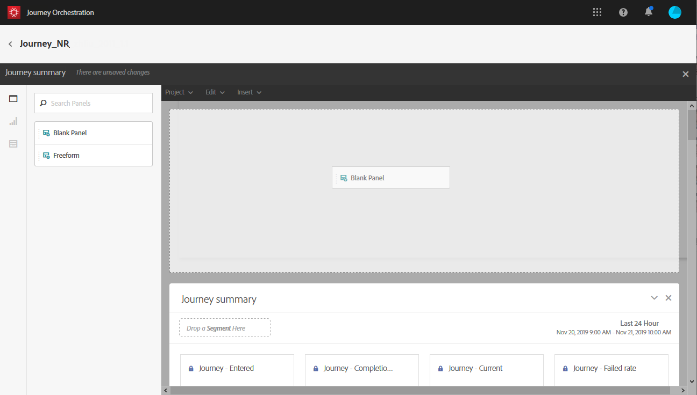
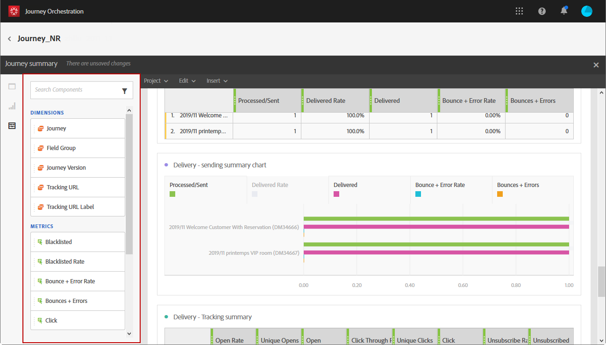
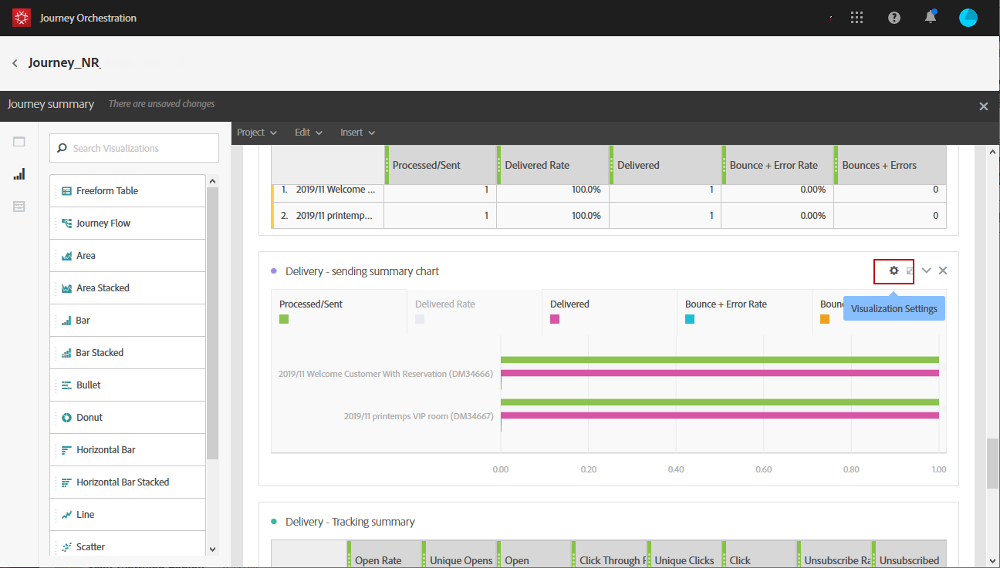

# 建立您的歷程報告 {#concept_rfj_wpt_52b}

>[!CAUTION]
>
>**正在尋找Adobe Journey Optimizer**？ 如需Journey Optimizer檔案，請按一下[這裡](https://experienceleague.adobe.com/zh-hant/docs/journey-optimizer/using/ajo-home){target="_blank"}。
>
>
>_本檔案參考已由Journey Optimizer取代的舊版Journey Orchestration資料。 如果您對Journey Orchestration或Journey Optimizer的存取權有任何疑問，請聯絡您的帳戶團隊。_

## 存取和建立報告 {#accessing-reports}

>[!NOTE]
>
>刪除歷程後，所有關聯報告將不再可用。

本節將說明如何建立或使用現成可用的報表。 結合面板、元件和視覺效果，以便更妥善地追蹤您的歷程是否成功。

若要存取歷程報告並開始追蹤傳送成功：

1. 在頂端功能表中，按一下 **[!UICONTROL Home]** 索引標籤。

1. 選取您要報告的歷程。

   請注意，您也可以在歷程清單中暫留在歷程上時，按一下&#x200B;**報告**&#x200B;來存取報告。

   

1. 按一下熒幕右上角的&#x200B;**[!UICONTROL Report]**&#x200B;圖示。

   

1. **[!UICONTROL Journey summary]**&#x200B;現成報告會出現在畫面上。 若要存取自訂報表，請按一下&#x200B;**[!UICONTROL Close]**&#x200B;按鈕。

   

1. 按一下&#x200B;**[!UICONTROL Create new project]**，從頭開始建立您的報表。

   

1. 從&#x200B;**[!UICONTROL Panels]**&#x200B;索引標籤，視需要拖放任意數目的面板或自由表格。 如需詳細資訊，請參閱此[區段](#adding-panels)。

   

1. 然後，您可以從&#x200B;**[!UICONTROL Components]**&#x200B;索引標籤將維度和量度拖放至自由表格，以開始篩選資料。 如需詳細資訊，請參閱此[區段](#adding-components)。

   

1. 若要更清楚地檢視您的資料，您可以從&#x200B;**[!UICONTROL Visualizations]**&#x200B;索引標籤新增視覺效果。 如需詳細資訊，請參閱此[區段](#adding-visualizations)。

## 新增面板{#adding-panels}

### 新增空白面板 {#adding-a-blank-panel}

若要啟動報表，您可以將一組面板新增至現成可用或自訂報表。 每個面板都包含不同的資料集，而且由自由表格和視覺效果組成。

此面板可讓您視需要建置報告。 您可以在報表中新增任意數量的面板，以篩選不同時段的資料。

1. 按一下&#x200B;**[!UICONTROL Panels]**&#x200B;圖示。 您也可以按一下&#x200B;**[!UICONTROL Insert tab]**&#x200B;並選取&#x200B;**[!UICONTROL New Blank Panel]**&#x200B;來新增面板。

   

1. 將&#x200B;**[!UICONTROL Blank Panel]**&#x200B;拖放到您的儀表板中。

   

您現在可以將自由表格新增至面板，以開始鎖定資料目標。

### 新增自由表格 {#adding-a-freeform-table}

自由表格可讓您建立表格，以使用&#x200B;**[!UICONTROL Component]**&#x200B;表格中可用的不同量度和維度來分析您的資料。

每個表格和視覺效果皆可調整大小，且可以移動以自訂報表。

1. 按一下&#x200B;**[!UICONTROL Panels]**&#x200B;圖示。

   

1. 將&#x200B;**[!UICONTROL Freeform]**&#x200B;專案拖放至您的儀表板。

   您也可以按一下「**[!UICONTROL Insert]**」索引標籤並選取「**[!UICONTROL New Freeform]**」，或在空白面板中按一下「**[!UICONTROL Add a freeform table]**」來新增表格。

   

1. 從&#x200B;**[!UICONTROL Components]**&#x200B;索引標籤拖放專案至欄和列，以建置您的表格。

   

1. 按一下&#x200B;**[!UICONTROL Settings]**&#x200B;圖示以變更資料在欄中的顯示方式。

   

   **[!UICONTROL Column settings]**&#x200B;由下列專案組成：

   * **[!UICONTROL Number]**：可讓您顯示或隱藏欄中的摘要數字。
   * **[!UICONTROL Percent]**：可讓您顯示或隱藏欄中的百分比。
   * **[!UICONTROL Interpret zero as no value]**：可讓您在值等於零時顯示或隱藏。
   * **[!UICONTROL Background]**：可讓您顯示或隱藏儲存格中的水準進度列。
   * **[!UICONTROL Include retries]**：可讓您在結果中包含重試。 這僅適用於&#x200B;**[!UICONTROL Sent]**&#x200B;和&#x200B;**[!UICONTROL Bounces + Errors]**。

1. 選取一或多個列，然後按一下&#x200B;**[!UICONTROL Visualize]**&#x200B;圖示。 視覺效果會新增，以反映您選取的列。

   

您現在可以視需要新增任意數量的元件，也可以新增視覺效果以提供資料的圖形表示。

## 新增元件{#adding-components}

元件可協助您使用不同的維度、量度和時段來自訂報表。

1. 按一下&#x200B;**[!UICONTROL Components]**&#x200B;標籤以存取元件清單。

   

1. **[!UICONTROL Components]**&#x200B;索引標籤中顯示的每個類別都會顯示五個最常使用的專案，按一下類別名稱即可存取其完整的元件清單。

   元件表格分為三個類別：

   * **[!UICONTROL Dimensions]**：從傳遞記錄檔取得詳細資料，例如收件者的瀏覽器或網域，或傳遞成功。
   * **[!UICONTROL Metrics]**：取得訊息狀態的詳細資料。 例如，已傳送訊息且使用者已將其開啟。
   * **[!UICONTROL Time]**：設定資料表的時段。

1. 將元件拖放至面板中，以開始篩選資料。

您可以視需要拖放任意數量的元件，並互相比較。

## 新增視覺效果{#adding-visualizations}

**[!UICONTROL Visualizations]**&#x200B;索引標籤可讓您拖放視覺效果專案，例如區域、環形圖和圖形。 視覺效果可提供資料的圖形表示。

1. 在&#x200B;**[!UICONTROL Visualizations]**&#x200B;索引標籤中，將視覺效果專案拖放到面板中。

   

1. 將視覺效果新增至面板後，報表會自動偵測自由表格中的資料。 選取視覺效果的設定。
1. 如果您有多個自由表格，請在&#x200B;**[!UICONTROL Data Source Settings]**&#x200B;視窗中選擇要新增到圖形中的可用資料來源。 按一下視覺效果標題旁的彩色點，即可使用此視窗。

   

1. 按一下&#x200B;**[!UICONTROL Visualization]**&#x200B;設定按鈕以直接變更圖形型別或圖形上顯示的內容，例如：

   * **[!UICONTROL Percentages]**：以百分比顯示值。
   * **[!UICONTROL Anchor Y Axis at Zero]**：即使值範圍在零以上，也強制將y軸設為零。
   * **[!UICONTROL Legend visible]**：讓您隱藏圖例。
   * **[!UICONTROL Normalization]**：強制值相符。
   * **[!UICONTROL Display Dual Axis]**：將另一個座標軸新增至您的圖表。
   * **[!UICONTROL Limit Max Items]**：限制顯示的圖表數量。
   * **[!UICONTROL Threshold]**：可讓您設定圖形的臨界值。 它會顯示為黑色虛線。

   

此視覺效果可讓您在報告中更清楚地檢視資料。
