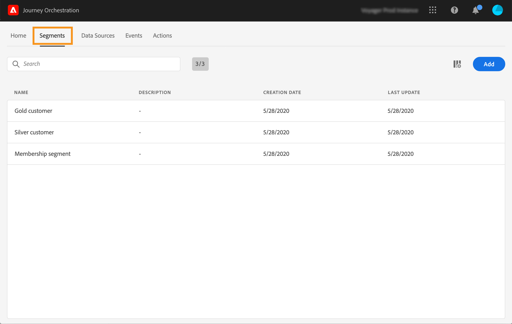

# 建立區段 {#creating-a-segment}

>[!CAUTION]
>
>**正在尋找Adobe Journey Optimizer**？ 如需Journey Optimizer檔案，請按一下[這裡](https://experienceleague.adobe.com/zh-hant/docs/journey-optimizer/using/ajo-home){target="_blank"}。
>
>
>_本檔案參考已由Journey Optimizer取代的舊版Journey Orchestration資料。 如果您對Journey Orchestration或Journey Optimizer的存取權有任何疑問，請聯絡您的帳戶團隊。_

您可以使用[Adobe Experience Platform劃分服務](https://experienceleague.adobe.com/docs/experience-platform/segmentation/home.html?lang=zh-Hant)來建立區段，或直接在[!DNL Journey Orchestration]中存取及建立區段。

1. 在頂端功能表中，按一下 **[!UICONTROL Segments]** 索引標籤。隨即顯示Adobe Experience Platform區段清單。 您可以在清單中搜尋特定區段。

   

1. 按一下「**[!UICONTROL Add]**」以建立新區段。 區段定義畫面可讓您設定定義區段所需的所有欄位。 此設定與分段服務中的設定相同。 請參閱[區段產生器使用手冊](https://experienceleague.adobe.com/docs/experience-platform/segmentation/ui/overview.html?lang=zh-Hant)。

   

您的區段現在可用於您的歷程，以建立條件或新增&#x200B;**[!UICONTROL Segment qualification]**&#x200B;事件。 請參閱[在條件](../segment/using-a-segment.md)和[事件活動](../building-journeys/segment-qualification-events.md)中使用區段。
