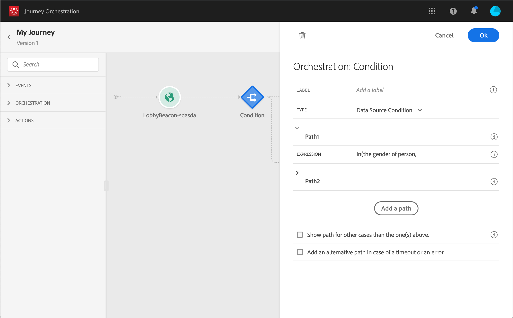
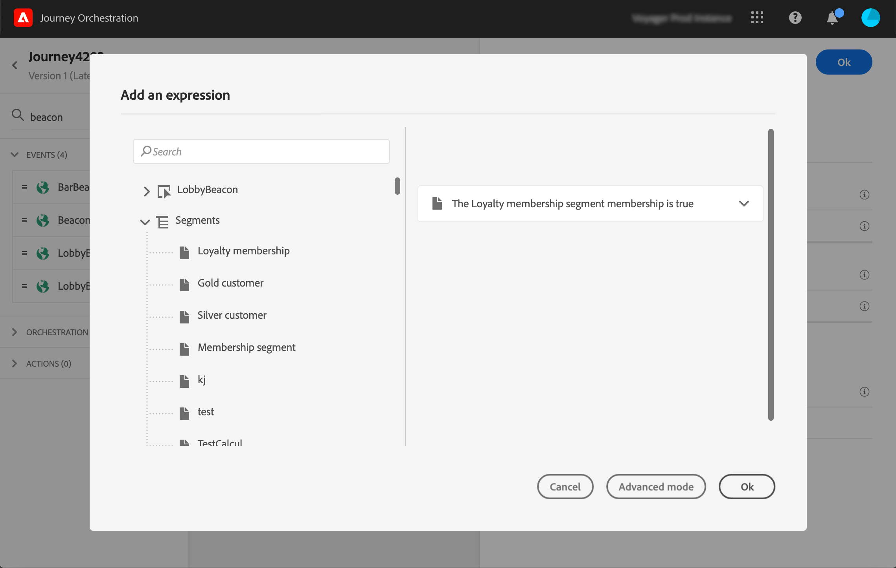

# 在條件中使用區段 {#using-a-segment}

本節說明如何在歷程條件中使用區段。 若要瞭解如何使用 **[!UICONTROL Segment qualification]** 歷程中的事件，請參閱此 [區段](../building-journeys/segment-qualification-events.md).

若要在歷程條件中使用區段，請遵循下列步驟：

1. 開啟歷程，拖放 **[!UICONTROL Condition]** 活動並選擇 **資料來源條件**.
   

1. 按一下 **[!UICONTROL Add a path]** 以取得所需的每個額外路徑。 對於每個路徑，按一下 **[!UICONTROL Expression]** 欄位。

   

1. 在左側，展開 **[!UICONTROL Segments]** 節點。 拖放您要用於條件的區段。 依預設，區段的條件為true。

   

   >[!NOTE]
   >
   >只有具備以下條件的個人： **已實現** 和 **現有** 區段參與狀態會視為區段的成員。 如需如何評估區段的詳細資訊，請參閱 [分段服務檔案](https://experienceleague.adobe.com/docs/experience-platform/segmentation/tutorials/evaluate-a-segment.html?lang=en#interpret-segment-results).

有關歷程條件以及如何使用簡單運算式編輯器的詳細資訊，請參閱 [條件活動](../building-journeys/condition-activity.md#about_condition).
