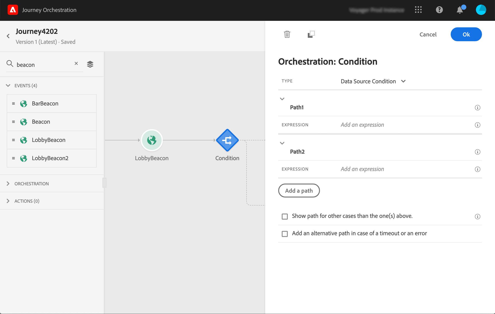

# 在條件中使用區段 {#using-a-segment}

本節說明如何在歷程條件中使用區段。 若要瞭解如何在歷程中 **[!UICONTROL Segment qualification]** 使用活動，請參閱活 [動活動](../building-journeys/segment-qualification-events.md)。

若要在歷程條件中使用區段，請遵循下列步驟：

1. 開啟歷程、放下活動 **[!UICONTROL Condition]** 並選擇「資 **料來源條件」**。
   

1. 按一 **[!UICONTROL Add a path]** 下所需的每個額外路徑。 對於每個路徑，按一下該 **[!UICONTROL Expression]** 欄位。

   

1. 在左側，展開節 **[!UICONTROL Segments]** 點。 拖放您要用於條件的區段。 依預設，區段上的條件為true。

   

如需歷程條件以及如何使用簡單運算式編輯器的詳細資訊，請參閱「 [條件」活動](../building-journeys/condition-activity.md#about_condition)。
