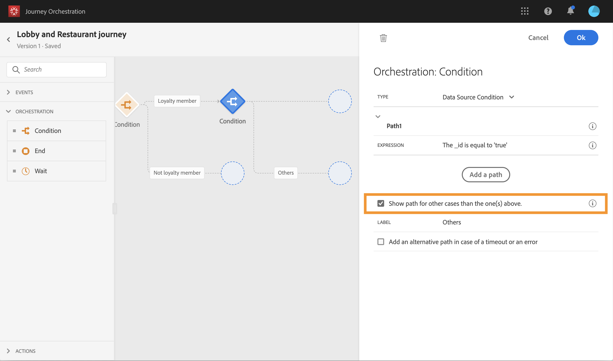
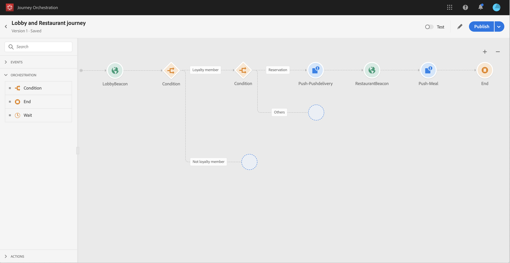
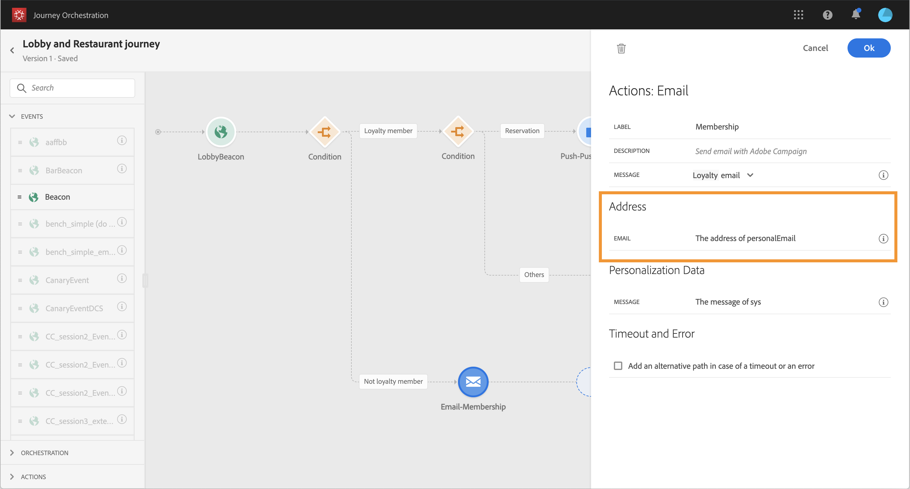

# 建立歷程 {#concept_owm_kdy_w2b}

**商業使用者**&#x200B;現在可以建立歷程。我們的歷程將包含下列活動：

* 兩個 **[!UICONTROL Event]** 活動：&quot;LobbyBeacon&quot;　及　&quot;RestaurantBeacon&quot;
* 兩個 **[!UICONTROL Condition]** 活動
* 3個 **[!UICONTROL Push]** 活動和　1 **[!UICONTROL Email]** 個活動（使用　Adobe Campaign Standard）
* **[!UICONTROL Wait]** 活動
* 四個 **[!UICONTROL End]** 活動

>[!NOTE]
>
>只有當您具有 Adobe Campaign Standard　時，浮動視窗才能使用　**[!UICONTROL Push]**　及 **[!UICONTROL Email]**　活動。

如需如何建立歷程的詳細資訊，請參閱 [](../building-journeys/journey.md)。

## 第一步{#section_ntb_ws1_ffb}

1. 在頂端功能表中，按一下 **[!UICONTROL Home]** 索引標籤及 **[!UICONTROL Create]**，以建立新的歷程。

   

1. 在右側顯示的設定窗格中，編輯歷程的屬性。新增名稱，並將其設定為持續一個月（從　12　月　1　日至　31　日)。

   

1. 從浮動視窗拖放「LobbyBeacon」事件至畫布，開始設計您的歷程。您也可以連按兩下浮動視窗中的事件，將之新增至畫布。

   

1. 現在，新增一個條件來檢查是否未在過去 24 小時內聯絡該人員，以及檢查他是否為忠誠會員。將條件活動拖放至歷程中。

   

1. 選擇 **[!UICONTROL Data Source Condition]** 類型，然後按一下 **[!UICONTROL Expression]** 欄位。您也可以定義條件標籤，該標籤將顯示在畫布的箭頭上。在範例中，我們會以「忠誠會員」取代「條件1」。

   

1. 根據 Adobe Experience Platform 資料來源提供的「timestamp」和「directMarketing.sends.value」欄位，按一下 **[!UICONTROL Advanced mode]** 並定義下列條件。運算式的語法為：

   ```
   count(#{ExperiencePlatformDataSource.MarltonExperience.experienceevent.all(
       currentDataPackField.directMarketing.sends.value > 0 and
       currentDataPackField.timestamp > nowWithDelta(-1, "days")).timestamp}) == 0
   and
       #{ExperiencePlatformDataSource.MarltonProfiles.Profile._customer.marlton.loyaltyMember}
   ```

   

1. 按一下 **[!UICONTROL Add a path]** 按鈕，為過去 24 小時內尚未聯絡且非忠誠會員的客戶建立第二個路徑。將路徑命名為「非忠誠度成員」。運算式的語法為：

   ```
   count(#{ExperiencePlatformDataSource.MarltonExperience.experienceevent.all(
       currentDataPackField.directMarketing.sends.value > 0 and
       currentDataPackField.timestamp > nowWithDelta(-1, "days").timestamp}) == 0
   and not
       #{ExperiencePlatformDataSource.MarltonProfiles.Profile._customer.marlton.loyaltyMember}
   ```

   >[!NOTE]
   >
   >在運算式的第二部分中，「設定檔」是選填欄位。

1. 我們需要選擇一個命名空間。根據架構屬性，預先選取命名空間。您可以將命名空間保持預選狀態。如需命名空間的詳細資訊，請參閱[](../event/selecting-the-namespace.md)。

在我們的使用案例中，我們只想對這兩種情況做出反應，所以不需要核取方塊 **[!UICONTROL Show path for other cases than the one(s) above]**。

在您的條件之後建立兩個路徑：

* _過去 24 小時內未與客戶聯絡且是忠誠會員的客戶。_
* _過去 24 小時未與客戶聯絡，且不是忠誠會員的客戶。_


## 第一個路徑：客戶是忠誠會員 {#section_otb_ws1_ffb}

1. 在第一個路徑中，我們會新增條件以確認他是否有訂房。將條件活動拖放至歷程中。

   

1. 根據從訂房系統擷取的保留狀態資訊選擇 **[!UICONTROL Data Source Condition]** 類型，以及定義條件：

   ```
   #{MarltonReservation.MarltonFieldGroup.reservation} == true
   ```

   

1. 當您從外部資料來源選取欄位時，畫面的右側會顯示設定外部資料來源時所定義的參數清單（請參閱[](../usecase/configuring-the-data-sources.md)）。在範例中，按一下參數名稱並定義訂房系統索引鍵 (Experience Cloud ID) 的值：

   ```
   @{LobbyBeacon.endUserIDs._experience.mcid.id}
   ```

   

1. 因為我們也未對沒有保留的客戶作出反應，因此我們需要核取方塊 **[!UICONTROL Show path for other cases than the one(s) above]**。

   

   已建立兩個路徑：

   * _已預訂客房的客戶_
   * _未預訂客房的客戶。_

   

1. 在第一個路徑（已預訂客房）中，拖放 **[!UICONTROL Push]** 活動、選擇您的行動應用程式和「歡迎」範本。

   

1. 定義系統傳送以進行推播的必要 **[!UICONTROL Target]** 欄位。

   * **[!UICONTROL Push platform]**：選取平台：**[!UICONTROL Apple Push Notification Server]** (Apple) 或 **[!UICONTROL Firebase Cloud Messaging]** (Android)。
   * **[!UICONTROL Registration token]**：使用進階模式，新增下列運算式（根據已設定的事件）:

      ```
      @{LobbyBeacon._experience.campaign.message.profileSnapshot.pushNotificationTokens.first().token}
      ```

1. 定義推播通知個人化欄位。在範例中：名字和姓氏。

1. 新增「RestaurantBeacon」事件。

   

1. 新增新的 **[!UICONTROL Push]** 活動，選取「餐費折扣」範本並定義 **[!UICONTROL Address]** 及 **[!UICONTROL Personalization]** 欄位。新增 **[!UICONTROL End]** 活動。

   

1. 我們只想在人員於歡迎推播後 6 小時內進入餐廳時，傳送餐點折扣推播通知。為此，我們需要使用等候活動。將游標置於歡迎推播活動上，然後按一下「+」符號。在新路徑中，新增等候活動並定義 6 小時的持續時間。將選擇第一個符合資格的活動。如果在歡迎推播後不到 6 小時收到餐廳事件，則會傳送推播活動。如果未在接下來的 6 小時內收到餐廳事件，則選擇等候。在等候活動之後放置 **[!UICONTROL End]** 活動。

   

1. 在訂房條件（未預訂客房）之後的第二個路徑，新增 **[!UICONTROL Push]** 活動並選取「房價」範本。新增 **[!UICONTROL End]** 活動。

   

## 第二條路徑：客戶不是忠誠會員{#section_ptb_ws1_ffb}

1. 在第一個條件（客戶不是忠誠會員）之後的第二個路徑，新增 **[!UICONTROL Email]** 活動並選取「忠誠會員資格」範本。

   

1. 在欄位 **[!UICONTROL Address]** 中，從資料來源選取電子郵件地址。

   

1. 從資料來源定義名字及姓氏個人化欄位。

   

1. 新增 **[!UICONTROL End]** 活動。

按一下 **[!UICONTROL Test]** 切換並測試您的歷程。如果發生任何錯誤，請停用測試模式、修改您的歷程並再次測試。有關測試模式的詳細資訊，請參閱[](../building-journeys/testing-the-journey.md)。


當測試結果確定時，您可以從右上角的下拉式功能表發佈您的歷程。


