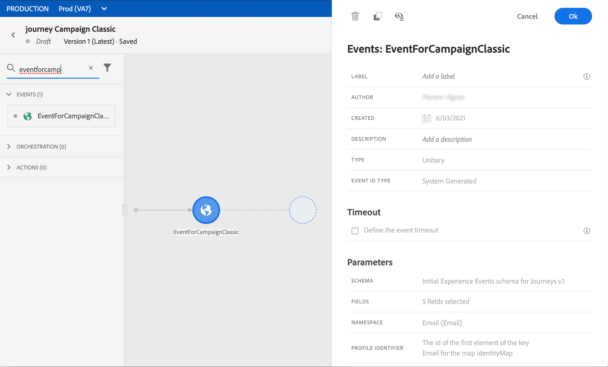

# 使用 Campaign v7/v8 傳送訊息 {#campaign-classic-use-case}

此使用案例提供使用與Adobe Campaign Classic v7和Adobe Campaign v8整合來傳送電子郵件所需的所有步驟。

我們將先在Campaign中建立交易式電子郵件範本。 然後，在Journey Orchestration中，我們將建立事件、動作並設計歷程。

若要深入瞭解Campaign整合，請參閱以下頁面：

* [建立行銷活動動作](../action/acc-action.md)
* [在歷程中使用動作](../building-journeys/using-adobe-campaign-classic.md).

**Adobe Campaign**

需要布建您的Campaign執行個體才能進行此整合。 需要設定異動訊息傳送功能。

1. 登入您的Campaign控制例項。

1. 下 **管理** > **Platform** > **分項清單**，選取 **事件型別** (eventType)分項清單。 建立新的事件型別（範例中為「journey-event」）。 稍後寫入JSON檔案時，您必須使用事件型別的內部名稱。

   

1. 中斷連線並重新連線至執行個體，使建立生效。

1. 下 **訊息中心** > **異動訊息範本**，根據先前建立的事件型別建立新的電子郵件範本。

   

1. 設計您的範本。 在此範例中，我們對設定檔的名字和訂單編號使用個人化。 名字位於Adobe Experience Platform資料來源中，而訂單編號則是來自Journey Orchestration事件的欄位。 請務必在Campaign中使用正確的欄位名稱。

   

1. 發佈您的交易式範本。

   

1. 現在您需要撰寫與範本相對應的JSON裝載。

```
{
     "channel": "email",
     "eventType": "journey-event",
     "email": "Email address",
     "ctx": {
          "firstName": "First name", "purchaseOrderNumber": "Purchase order number"
     }
}
```

* 對於頻道，您需要輸入「電子郵件」。
* 對於eventType，請使用先前建立之事件型別的內部名稱。
* 電子郵件地址將是變數，因此您可以鍵入任何標籤。
* 在ctx底下，個人化欄位也是變數。

**Journey Orchestration**

1. 首先，您需要建立事件。 請務必加入「purchaseOrderNumber」欄位。

   

1. 然後，您需要在Journey Orchestration中建立與您的Campaign範本對應的動作。 在 **動作型別** 下拉式清單，選取 **Adobe Campaign Classic**.

   

1. 按一下 **裝載欄位** 並貼上先前建立的JSON。

   

1. 針對電子郵件地址和兩個個人化欄位，請變更 **常數** 至 **變數**.

   

1. 現在建立新歷程，並從先前建立的事件開始。

   

1. 新增動作，並將每個欄位對應到Journey Orchestration中的正確欄位。

   

1. 新增 **結束** 活動並測試您的歷程。

   

1. 您現在可以發佈您的歷程。
