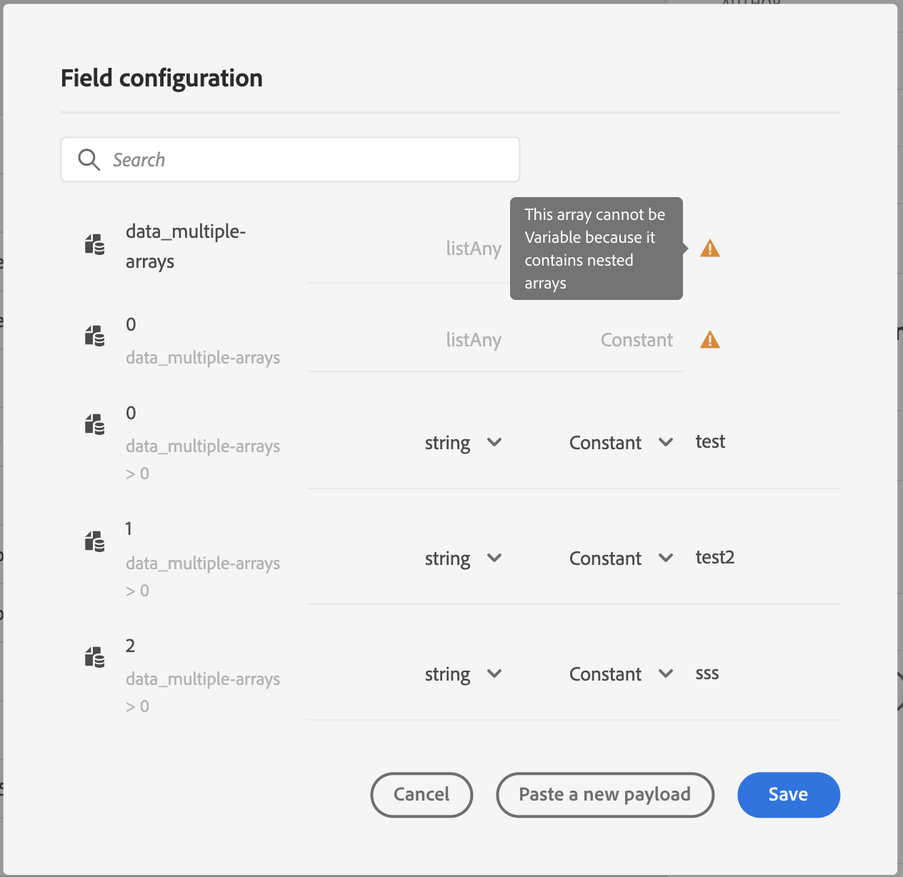

# 使用自訂動作動態傳遞集合{#passing-collection}


>[!CAUTION]
>
>**正在尋找Adobe Journey Optimizer**？ 如需Journey Optimizer檔案，請按一下[這裡](https://experienceleague.adobe.com/zh-hant/docs/journey-optimizer/using/ajo-home){target="_blank"}。
>
>
>_本檔案參考已由Journey Optimizer取代的舊版Journey Orchestration資料。 如果您對Journey Orchestration或Journey Optimizer的存取權有任何疑問，請聯絡您的帳戶團隊。_


您可以在自訂動作引數中傳遞集合，這些引數將在執行階段以動態方式填入。 支援兩種集合：

* 簡單集合：簡單資料型別的陣列，例如，使用listString：

  ```
  {
   "deviceTypes": [
       "android",
       "ios"
   ]
  }
  ```

* 物件集合：JSON物件的陣列，例如：

  ```
  {
  "products":[
     {
        "id":"productA",
        "name":"A",
        "price":20.1
     },
     {
        "id":"productB",
        "name":"B",
        "price":10.0
     },
     {
        "id":"productC",
        "name":"C",
        "price":5.99
     }
   ]
  }
  ```

## 限制 {#limitations}

* 目前不支援物件陣列中的巢狀物件陣列。 例如：

  ```
  {
  "products":[
    {
       "id":"productA",
       "name":"A",
       "price":20,
       "locations": [{"name": "Paris"}, {"name": "London"}]
    },
   ]
  }
  ```

* 若要使用測試模式測試集合，您需要使用程式碼檢視模式。 目前商業事件不支援程式碼檢視模式。 您只能傳送包含單一元素的集合。

## 一般程式 {#general-procedure}

在本節中，我們將使用以下JSON裝載範例。 這是一個物件陣列，其中的欄位是一個簡單的集合。

```
{
  "ctxt": {
    "products": [
      {
        "id": "productA",
        "name": "A",
        "price": 20.1,
        "color":"blue",
        "locations": [
          "Paris",
          "London"
        ]
      },
      {
        "id": "productB",
        "name": "B",
        "price": 10.99
      }
    ]
  }
}
```

您可以看到「products」是兩個物件的陣列。 您至少需要一個物件。

1. 建立您的自訂動作。 請參閱[此頁面](../action/about-custom-action-configuration.md)。

1. 在&#x200B;**[!UICONTROL Action parameters]**&#x200B;區段中，貼上JSON範例。 顯示的結構為靜態：貼上裝載時，所有欄位都會定義為常數。

   

1. 如有需要，請調整欄位型別。 集合支援下列欄位型別：listString、listInteger、listDecimal、listBoolean、listDateTime、listDateTimeOnly、listDateOnly、listObject

   >[!NOTE]
   >
   >根據裝載範例自動推斷欄位型別。

1. 如果您想要以動態方式傳遞物件，則需要將物件設定為變數。 在此範例中，我們將「products」設為變數。 物件中包含的所有物件欄位都會自動設定為變數。

   >[!NOTE]
   >
   >裝載範例的第一個物件用於定義欄位。

1. 針對每個欄位，定義將顯示在歷程畫布中的標籤。

   

1. 建立您的歷程並新增您建立的自訂動作。 請參閱[此頁面](../building-journeys/using-custom-actions.md)。

1. 在&#x200B;**[!UICONTROL Action parameters]**&#x200B;區段中，使用進階運算式編輯器定義陣列引數（範例中為「products」）。

   

1. 對於以下每個物件欄位，輸入來源XDM結構描述中的對應欄位名稱。 如果名稱相同，則不需要這樣做。 在我們的範例中，我們只需要定義「product id」和「color」。

   

針對陣列欄位，您也可以使用進階運算式編輯器來執行資料操作。 在下列範例中，我們使用[篩選器](../functions/functionfilter.md)和[交集](../functions/functionintersect.md)函式：


## 特定案例{#examples}

針對異質型別和陣列陣列，陣列是以listAny型別定義。 您只能對應個別專案，但無法將陣列變更為變數。



異質型別範例：

```
{
    "data_mixed-types": [
        "test",
        "test2",
        null,
        0
    ]
}
```

陣列陣列範例：

```
{
    "data_multiple-arrays": [
        [
            "test",
            "test1",
            "test2"
        ]
    ]
}
```

**相關主題**

[使用自訂動作](../building-journeys/using-custom-actions.md)
