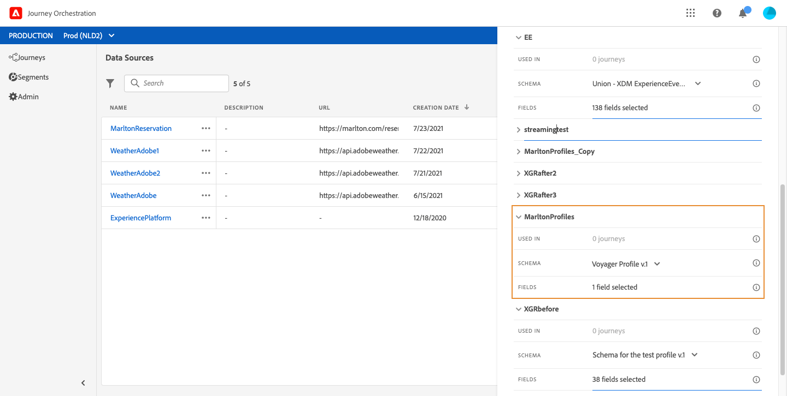
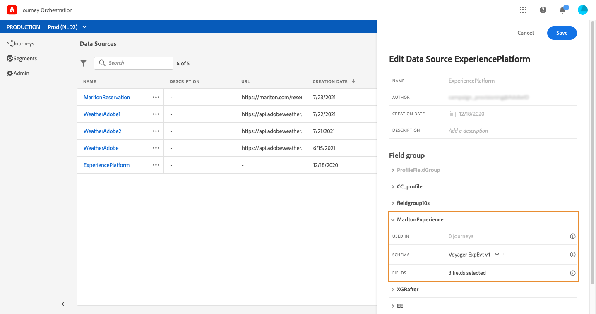
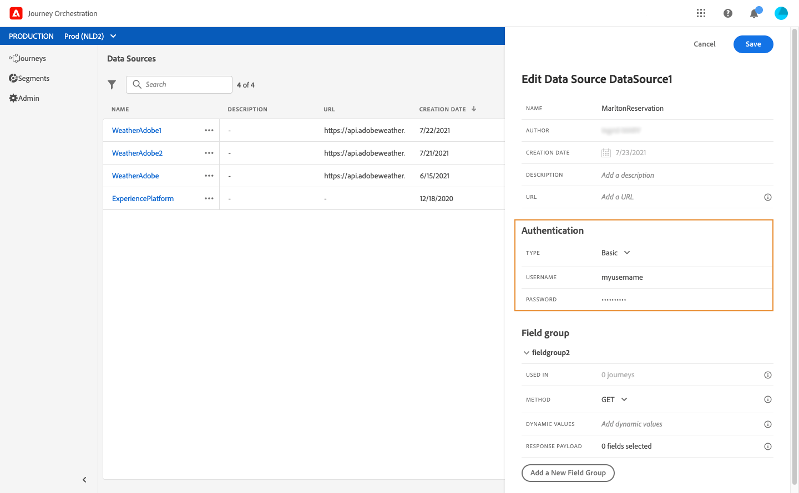
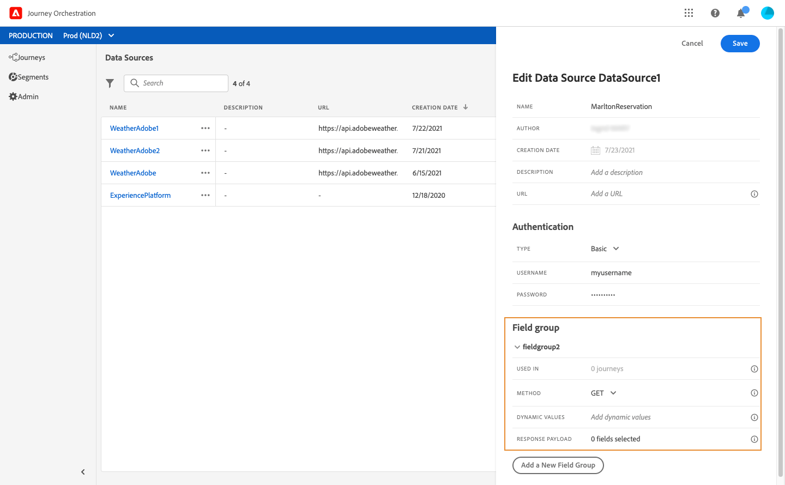

# 設定資料來源 {#concept_vml_hdy_w2b}

在我們的使用案例中，我們希望將個性化資料用於我們的郵件。 我們還需要檢查此人是否是忠誠成員，並且在過去24小時內未聯繫到他。 此資訊儲存在Real-time Customer Profile資料庫中。 的 **技術用戶** 需要配置Adobe Experience Platform資料源以檢索這些欄位。

有關資料源配置的其他資訊，請參閱 [此頁](../datasource/about-data-sources.md)。

1. 在菜單窗格中，選擇 **[!UICONTROL Admin]**。 在 **[!UICONTROL Data sources]** ，按一下 **[!UICONTROL Manage]**。
1. 選擇內置的Adobe Experience Platform資料源。

   

1. 在預配置的組欄位中，檢查是否選擇了以下欄位：

   * _person > name > firstName_
   * _person > name > lastName_
   * _個人電子郵件>地址_

1. 按一下 **[!UICONTROL Add a New Field Group]**，選擇 **[!UICONTROL Profiles]** 模式並添加 **會員** 來瞭解我們的情況。 的 **會員** 欄位是自定義欄位，已添加到XDM中：&quot;_customer > marlton > loyaltyMember&quot;

   

1. 按一下 **[!UICONTROL Add a New Field Group]**，選擇 **[!UICONTROL ExperienceEvent]** 模式，並選擇在給定期間內發送的消息數滿足條件所需的欄位： _時間戳_ 日期和 _directMarketing >發送>值_ 的子菜單。

   

1. 按一下「**[!UICONTROL Save]**」。

我們還需要檢查該人在酒店預訂系統中是否有預訂。 的 **技術用戶** 需要配置第二個資料源以檢索此欄位。

1. 在資料源清單中，按一下 **[!UICONTROL Add]** 添加新的外部資料源以定義到酒店預訂系統的連接。

   

1. 輸入資料源的名稱和外部服務的URL，例如： _https://marlton.com/reservation_

   >[!CAUTION]
   >
   >基於安全考量，我們強烈建議您使用 HTTPS。

1. 根據外部服務配置設定身份驗證：**[!UICONTROL No authentication]**、**[!UICONTROL Basic]**、**[!UICONTROL Custom]** 或 **[!UICONTROL API key]**。在示例中，我們為類型選擇「基本」，並指定API調用的用戶名和密碼。

   

1. 按一下 **[!UICONTROL Add a New Field Group]** 定義要檢索的資訊和API參數。 例如，只有一個參數(id)，因此我們需要建立一個包含以下資訊的欄位組：

   * **[!UICONTROL Method]**：選取 POST 或 GET 方法。在本例中，我們選取 GET 方法。
   * **[!UICONTROL Response Payload]**:按一下 **[!UICONTROL Payload]** 欄位並貼上有效負載示例。 確認欄位類型是否正確。每次呼叫 API 時，系統都會擷取有效負載範例中包含的所有欄位。在本示例中，負載僅包含保留狀態：

   ```
   {
       "reservation" : true
   }
   ```

   * **[!UICONTROL Dynamic Values]**:在示例中輸入與用於標識每個客戶的鍵對應的參數「id」。 此參數的值將在行程中定義。

   

1. 按一下「**[!UICONTROL Save]**」。

   資料源現在已配置並準備在您的旅途中使用。
