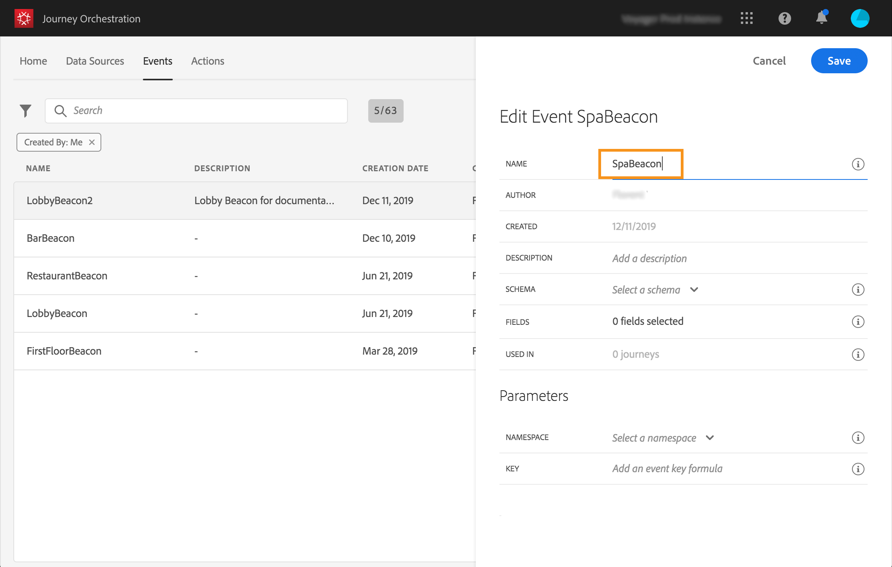
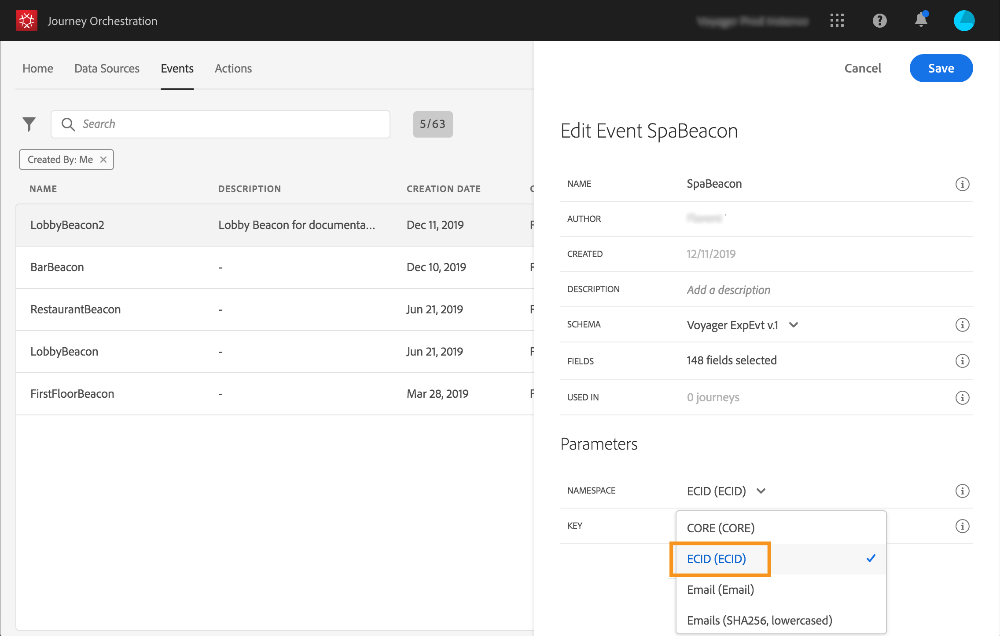
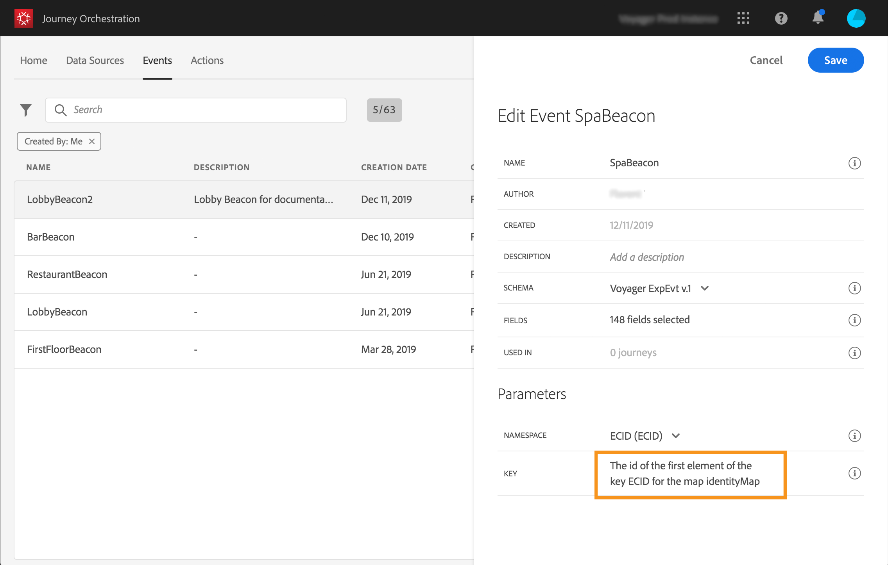

# 設定事件{#concept_y44_hcy_w2b}

在我們的案例中，每次有人靠近放置在spa旁邊的指標時，我們都需要收到一個事件。 此 **技術使用者** 需要設定系統將在歷程中接聽的事件。

有關事件設定的其他資訊，請參閱 [此頁面](../event/about-events.md).

1. 在頂端功能表中，按一下 **[!UICONTROL Events]** 標籤並按一下 **[!UICONTROL Add]** 以建立新事件。

   

1. 我們輸入的名稱，不含空格或特殊字元：「SpaBeacon」。

   

1. 接著，我們選取結構描述，並定義此事件預期的裝載。 我們從XDM標準化模型中選取所需的欄位。 我們需要Experience CloudID才能在即時客戶個人檔案資料庫中識別人員： _endUserIDs > experience > mcid > id_. 系統會自動為此事件產生ID。 此ID儲存在 **[!UICONTROL eventID]** 欄位(_experience > campaign >協調流程> eventID_)。 推播事件的系統不應產生ID，而應使用裝載預覽中可用的ID。 在我們的使用案例中，此ID可用來識別信標位置。 每次有人接近spa信標時，系統都會傳送包含此特定事件ID的事件。 這可讓系統知道哪些信標觸發了事件傳送。

   

   >[!NOTE]
   >
   >欄位清單會因結構描述而異。 根據結構描述定義，某些欄位可能是必填欄位並預先選取。

1. 我們需要選擇一個命名空間。根據架構屬性，預先選取命名空間。您可以將命名空間保持預選狀態。如需名稱空間的詳細資訊，請參閱 [此頁面](../event/selecting-the-namespace.md).

   

1. 系統會根據結構描述屬性及選取的名稱空間預先選取金鑰。 您可以保留它。

   

1. 按一下「**[!UICONTROL Save]**」。

1. 按一下 **[!UICONTROL View Payload]** 圖示可預覽系統預期的裝載，並與負責事件傳送的人員共用。 需要在Mobile Services管理主控台的回傳中設定此裝載。

   

   事件已準備好用於您的歷程。 您現在需要設定行動應用程式，才能將預期的裝載傳送至串流獲取API端點。 請參閱[此頁面](../event/additional-steps-to-send-events-to-journey-orchestration.md)。
