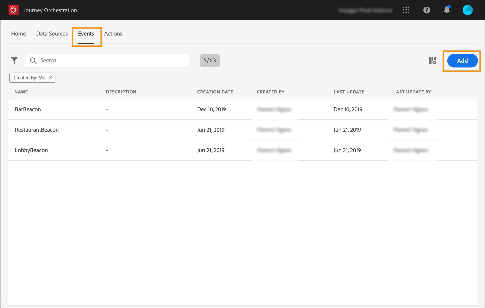

# 設定事件{#concept_y44_hcy_w2b}

在我們的案例中，每當使用者在位於SPA旁的信標附近行走時，就需要收到活動。 **技術使用者**&#x200B;需要設定系統在歷程中將監聽的事件。

有關事件配置的其他資訊，請參閱[此頁](../event/about-events.md)。

1. 在頂端功能表中，按一下&#x200B;**[!UICONTROL Events]**&#x200B;標籤，然後按一下&#x200B;**[!UICONTROL Add]**&#x200B;以建立新事件。

   

1. 我們輸入的名稱不含空格或特殊字元：&quot;SpaBeacon&quot;。

   

1. 然後，我們選取結構並定義此事件預期的裝載。 從XDM歸一化模型中選取所需欄位。 我們需要Experience CloudID來識別即時客戶個人檔案資料庫中的人員：_endUserIDs > experience > mcid > id_。 系統會自動為此事件產生ID。 此ID儲存在&#x200B;**[!UICONTROL eventID]**&#x200B;欄位(_experience > campaign > orchestration > eventID_)中。 推送事件的系統不應產生ID，而應使用有效負載預覽中可用的ID。 在我們的使用案例中，此ID用於識別信標位置。 每當使用者在spa信標附近行走時，就會傳送包含此特定事件ID的事件。 這可讓系統知道觸發事件傳送的信標。

   

   >[!NOTE]
   >
   >欄位清單因結構而異。 根據架構定義，某些欄位可能是必填欄位，且已預先選取。

1. 我們需要選擇一個命名空間。根據架構屬性，預先選取命名空間。您可以將命名空間保持預選狀態。如需命名空間的詳細資訊，請參閱[本頁](../event/selecting-the-namespace.md)。

   

1. 系統會根據架構屬性和選取的命名空間來預先選取金鑰。 你可以留著。

   

1. 按一下「**[!UICONTROL Save]**」。

1. 按一下&#x200B;**[!UICONTROL View Payload]**&#x200B;圖示可預覽系統預期的有效負載，並將其共用給負責事件傳送的人員。 此裝載需在Mobile Services管理控制台的回傳中設定。

   

   事件已準備好用於您的歷程。 您現在需要設定行動應用程式，以便將預期的裝載傳送至串流獲取API端點。 請參閱[此頁面](../event/additional-steps-to-send-events-to-journey-orchestration.md)。
