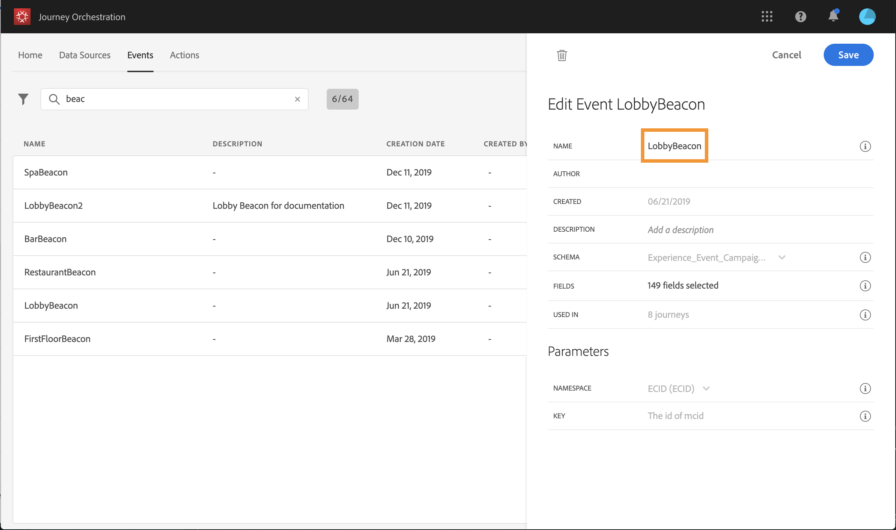
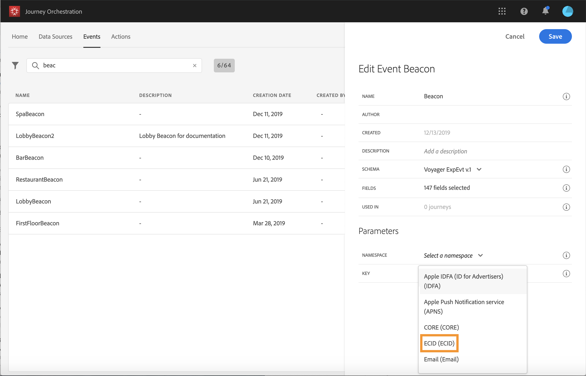
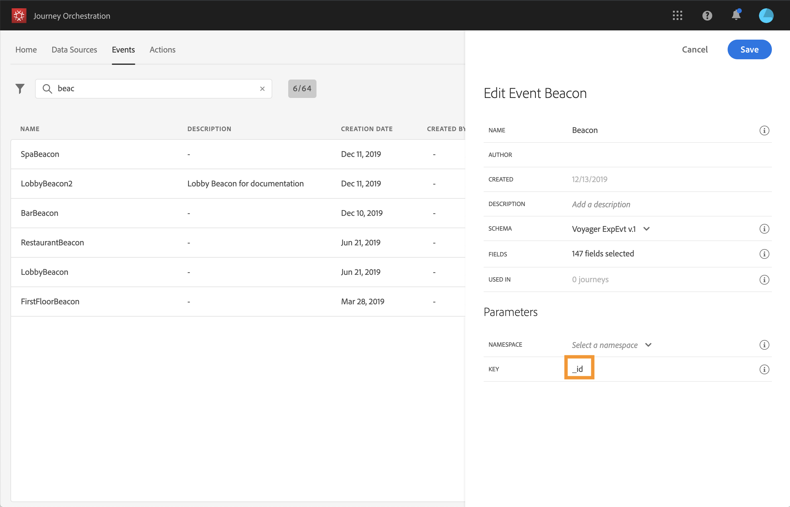
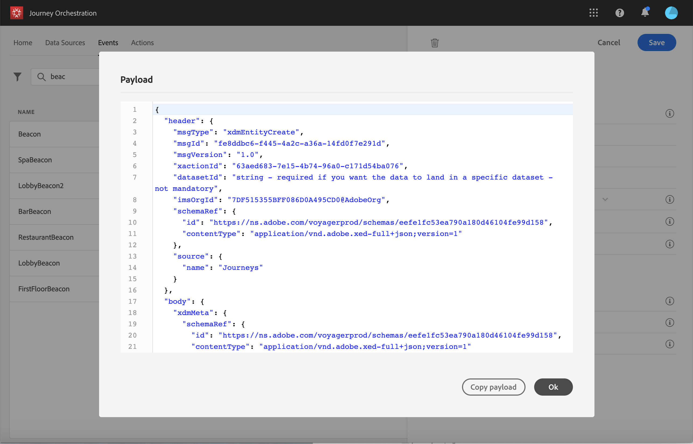

# 設定事件 {#concept_sbp_5cy_w2b}

在我們的情景中，每當一個人進入馬爾頓酒店和餐廳時，我們需要接受一個活動。 的 **技術用戶** 需要配置我們希望系統在旅途中收聽的兩個事件。

有關事件配置的其他資訊，請參閱 [此頁](../event/about-events.md)。

1. 在頂部菜單中，按一下 **[!UICONTROL Events]** 頁籤 **[!UICONTROL Add]** 的子菜單。

   

1. 我們輸入沒有空格或特殊字元的名稱：&quot;大廳信標&quot;。

   

1. 然後，我們選擇該架構並定義此事件所需的負載。 從XDM歸一化模型中選取所需欄位。 我們需要Experience CloudID來標識即時客戶配置檔案資料庫中的人員：&quot;endUserIDs > _experience > mcid > id&quot;。

   我們還需要註冊令牌來發送推送消息：&quot;_experience > campigm > message > profile > pushNotificationTokens > token&quot;

   將自動為此事件生成ID。 此ID儲存在 **[!UICONTROL eventID]** 欄位(「_experience > campaign > orchestration > eventID」)。 推送事件的系統不應生成ID，它應使用負載預覽中可用的ID。 在我們的使用案例中，此ID用於標識信標位置。 每次人員在大堂信標附近散步時，都會發送包含此特定事件ID的事件。 同樣的原則也適用於餐廳的信標事件。 這樣，系統就可以知道觸發事件發送的信標。

   

   >[!NOTE]
   >
   >欄位清單因方案而異。 根據架構定義，某些欄位可能是必需的並且預先選定。

1. 我們需要選擇一個命名空間。根據架構屬性，預先選取命名空間。您可以將命名空間保持預選狀態。有關命名空間的詳細資訊，請參見 [此頁](../event/selecting-the-namespace.md)。

   

1. 基於架構屬性和選定的命名空間預選鍵。 你可以留著。

   

1. 按一下「**[!UICONTROL Save]**」。

1. 按一下 **[!UICONTROL View Payload]** 表徵圖，預覽系統預期的負載，並將其與負責事件發送的人員共用。  需要在移動服務管理控制台的後退中配置此負載。

   

同樣，建立「RestaurantBeacon」事件。 您的兩個信標事件已建立，現在可用於我們的旅程。 現在，您需要配置移動應用程式，以便它能夠將預期的負載發送到流接收API端點。 請參閱[此頁面](../event/additional-steps-to-send-events-to-journey-orchestration.md)。
