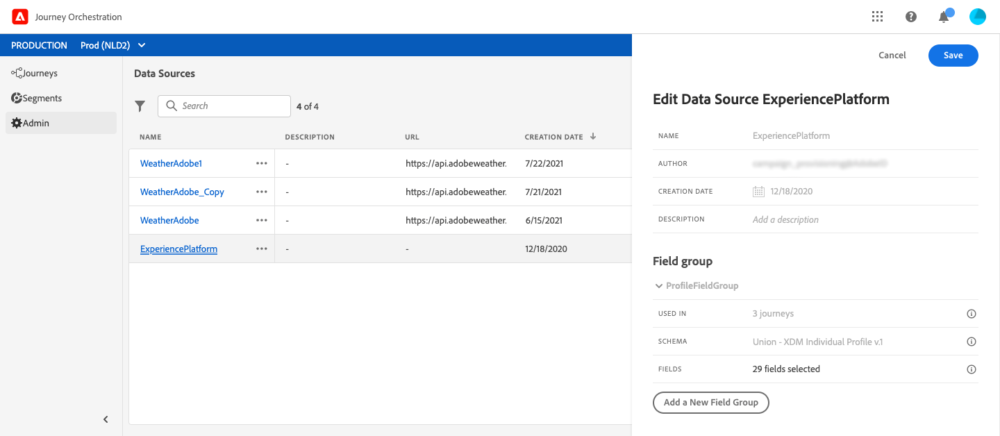

# 運用Journey AI {#concept_dsh_1ry_wfb}

此使用案例將告訴您如何運用疲勞分數，以避免在您的歷程中過度招攬客戶。

>[!NOTE]
>
>預測性疲勞分數功能僅適用於使用Adobe Campaign標準資料服務功能的客戶。

## 設定事件 {#section_ptb_ws1_ffb}

請遵循中所述的步驟 [](../event/about-events.md)。

## 設定資料來源 {#section_o3n_4yy_wfb}

執行以下步驟以選擇內置資料源中的疲勞分數欄位：

1. 在頂端功能表中，按一 **[!UICONTROL Data Sources]** 下標籤並選取內建的Adobe Experience Platform資料來源。

   

1. 檢查是否已選取使用案例所需的欄位。
1. 按一 **[!UICONTROL Add a New Field Group]**&#x200B;下，選取 **[!UICONTROL Profiles]** 模型並新增和欄 **[!UICONTROL fatigueLevel]** 位( **[!UICONTROL fatigueScore]** 在「歷程AI」>「 _emailScore」>「疲勞」_)。

   

1. 按一下 **[!UICONTROL Save]**。

## 建立歷程 {#section_uzm_pyy_wfb}

若要建立、驗證和發佈歷程，請依照中所述的步驟進行 [](../building-journeys/journey.md)。

在我們的使用案例中，我們運用了此 **[!UICONTROL fatigueLevel]** 欄位。 您也可以使用欄 **[!UICONTROL fatigueScore]** 位。

執行下列步驟，以利用歷程中的疲勞程度：

1. 在歷程中新增事件和條件。

   

1. 選擇類 **[!UICONTROL Data Source Condition]** 型，然後在欄位中按一 **[!UICONTROL Expression]** 下。

   

1. 使用簡單的運算式編輯器，尋找欄位( **[!UICONTROL fatigueLevel]**_ExperiencePlatformDataSource > JourneyAIScores > Profile > journeyAI > emailScore > fatigue_)，將它拖曳至右側並建立下列條件： &quot;fatigueLevel等於&quot;Low&quot;。 按一下 **[!UICONTROL Ok]**。

   

   進階運算式為：

   ```
   #{ExperiencePlatformDataSource.JourneyAIScores.Profile.journeyAI.emailScore.fatigue.fatigueLevel} == "low"
   ```

1. 在此條件下，為中高疲勞級別建立兩個其它路徑。

   

1. 現在，您可以為每個疲勞級別添加不同的操作。

   
