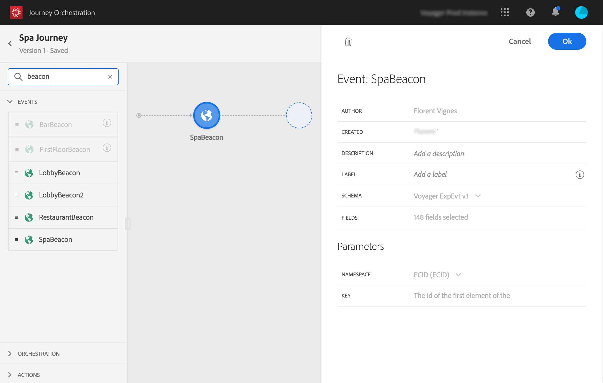
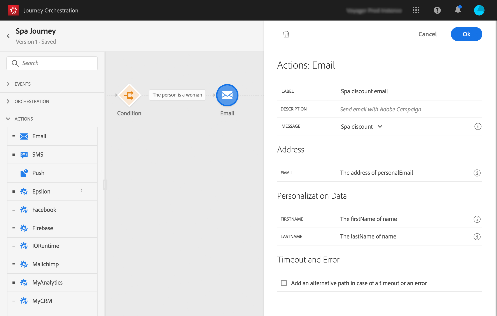
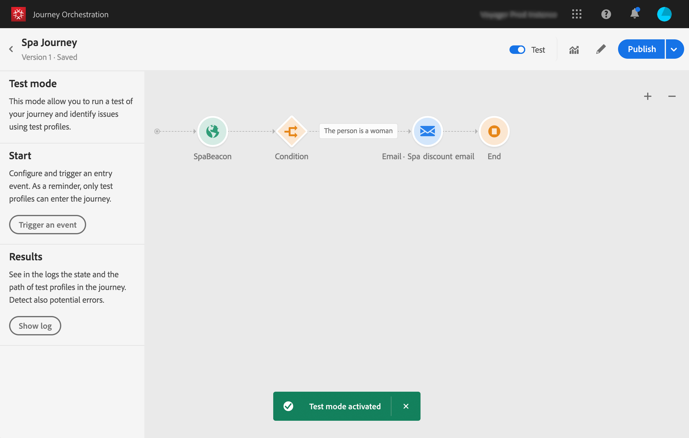

# 建立歷程{#concept_eyw_mcy_w2b}

**商業使用者**&#x200B;現在可以建立歷程。我們的旅程將僅包含一條路徑，其中包含下列活動：

* &quot;SpaBeacon&quot; **[!UICONTROL Event]** :當一個人走在水療信標附近時，系統會收到一個活動，而旅程將開始。
* a **[!UICONTROL Condition]**&#x200B;活動，以檢查此人是否為女性
* **[!UICONTROL Email]**&#x200B;活動（使用Adobe Campaign Standard）
* **[!UICONTROL End]**&#x200B;活動

>[!NOTE]
>
>只有當您具有 Adobe Campaign Standard　時，浮動視窗才能使用　**[!UICONTROL Push]**　及 **[!UICONTROL Email]**　活動。

如需如何建立歷程的詳細資訊，請參閱[本頁](../building-journeys/journey.md)。

1. 在頂端功能表中，按一下 **[!UICONTROL Home]** 索引標籤及 **[!UICONTROL Create]**，以建立新的歷程。

   

1. 在右側顯示的設定窗格中，編輯歷程的屬性。我們將它命名為&quot;Spa之旅&quot;，並設為持續一個月，從12月1日到31日。

   

1. 從浮動視窗拖放「SpaBeacon」事件至畫布，開始設計您的旅程。 您也可以連按兩下浮動視窗中的事件，將之新增至畫布。

   

1. 現在，我們添加一個條件來檢查此人是否是女性。 將條件活動拖放至歷程中。

   

1. 選擇 **[!UICONTROL Data Source Condition]** 類型，然後按一下 **[!UICONTROL Expression]** 欄位。您也可以定義條件標籤，該標籤將顯示在畫布的箭頭上。

   

1. 使用簡單的運算式編輯器，尋找性別欄位(_person > geder_)，並將其拖曳至右側以建立下列條件：&quot;性別等於&quot;女性&quot;。

   

1. 刪除&#x200B;**[!UICONTROL Email]**&#x200B;活動並選擇您的「Spa折扣」事務性消息傳送模板。 此範本是使用Adobe Campaign設計。 請參閱此[頁](https://docs.adobe.com/content/help/zh-Hant/campaign-standard/using/communication-channels/transactional-messaging/about-transactional-messaging.html)。

   

1. 在&#x200B;**[!UICONTROL Email]**&#x200B;欄位內按一下，並從資料來源選取電子郵件地址。

   

1. 同樣地，從資料來源定義名字和姓氏個人化欄位。

   

1. 刪除&#x200B;**[!UICONTROL End]**&#x200B;活動。

   

1. 按一下&#x200B;**[!UICONTROL Test]**&#x200B;切換，並使用測試描述檔測試您的歷程。 如果發生任何錯誤，請停用測試模式、修改您的歷程並再次測試。有關測試模式的詳細資訊，請參閱[本頁](../building-journeys/testing-the-journey.md)。

   

1. 當測試結果確定時，您可以從右上角的下拉式功能表發佈您的歷程。

   

下次，當一名女性走近水療信標時，她會立即收到一封「Spa折扣」的個人化電子郵件。
